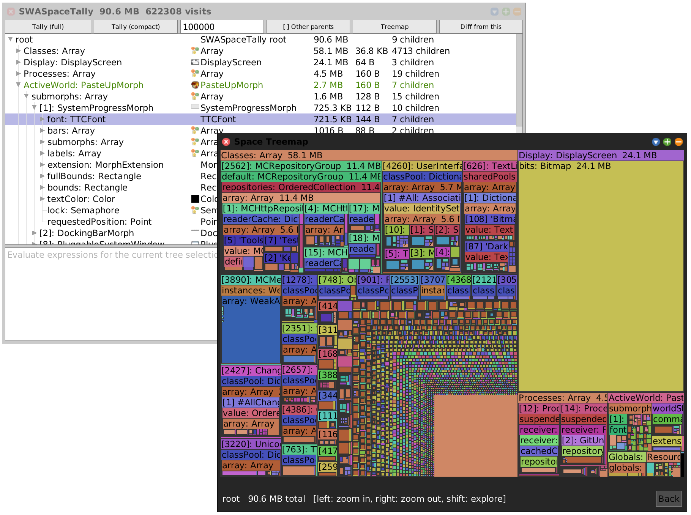

# Squeak ObjectSpaceTally

[docs](doc/SWASpaceTally.md) 

Structural memory analysis for Squeak. Instead of a flat per-class table
like the built-in `SpaceTally`, this walks the live object graph from the
roots and builds a tree of space usage you can explore three ways:

- **Explorer**, a multi-column tree browser with Tally / Treemap / Diff actions
- **Treemap**, a squarified treemap where area = byte size, with zoom and tooltips
- **Diff**, compares two tallies to isolate exactly what your app allocated

The treemap shares a common view (`SWAView`) and nav panel (`SWANavPanel`) with
its sibling tools -- the **st-spy** message-tally profiler and the static **Code
Map** -- and a common **dataset** layer. Any analysis (coverage, duplication, a
space tally) can be loaded onto the Code Map to colour/size it, and any open panel
can be picked as a live data source from the **Data** menu -- e.g. colour the Code
Map by measured memory, or by which methods the profiler sampled. A space tally
loaded from a node tree can even *become* the Code Map's structure via the **Tree**
button (morph one tool into another). See the
[docs](doc/SWASpaceTally.md#decorating-the-code-map-with-per-class-bytes).




## Installation

To load this package:

```smalltalk
Metacello new
    baseline: 'ObjectSpaceTally';
    repository: 'github://hpi-swa-lab/squeak-object-space-tally:main/src';
    load.
```

To develop this package, use GitS. 

## Quick Start

```smalltalk
spaceTally := SWASpaceTally new
		trackOtherParents: true;
		walk;
		compact:100000.

spaceTally openExplorer.
spaceTally openTreemap.
```

Or from the world menu: **open... -> Space Tally** (or **Code Map** for the
static package/class/method treemap).


## Authors

* Jens Lincke, Software-Architecture Group, HPI, 2026

## AI Usage

* Created with the help of [SqueakMCP](https://github.com/hpi-swa-lab/squeak-mcp) / OpenCode / Claude Opus

## License

MIT -- see [LICENSE](LICENSE).
