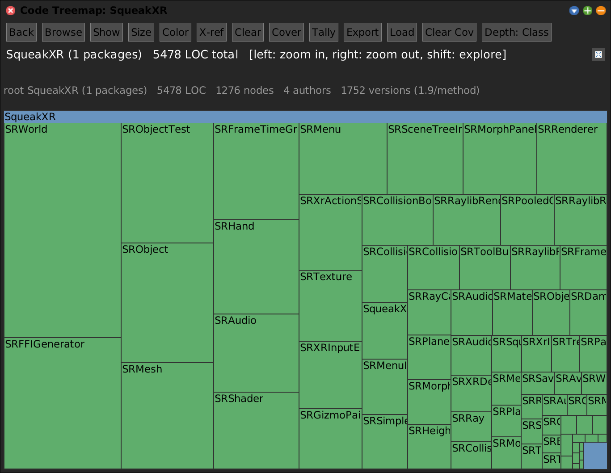
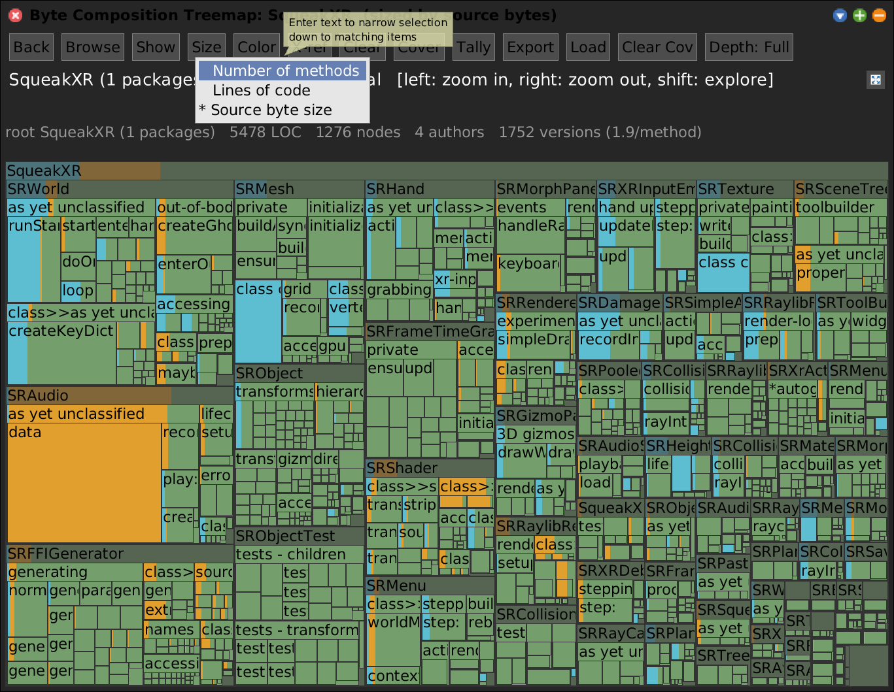
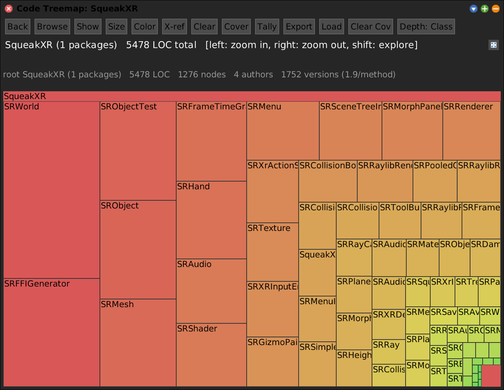
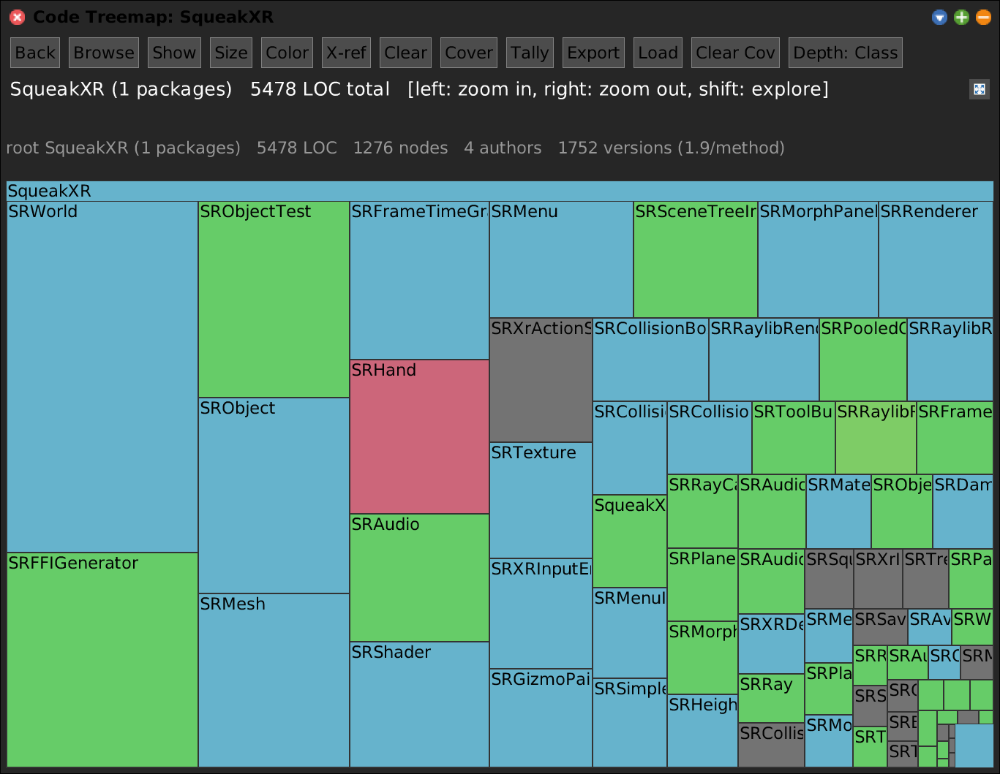
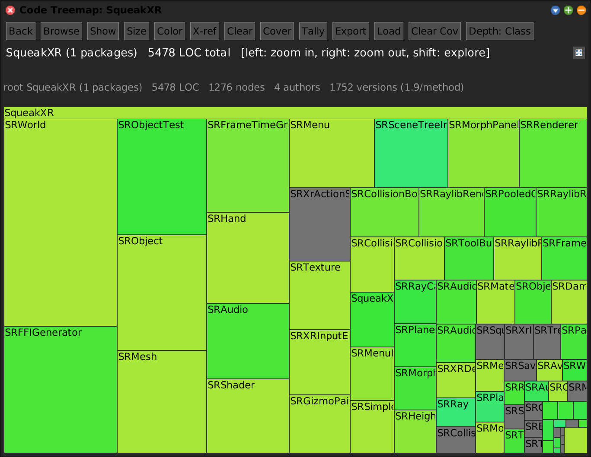
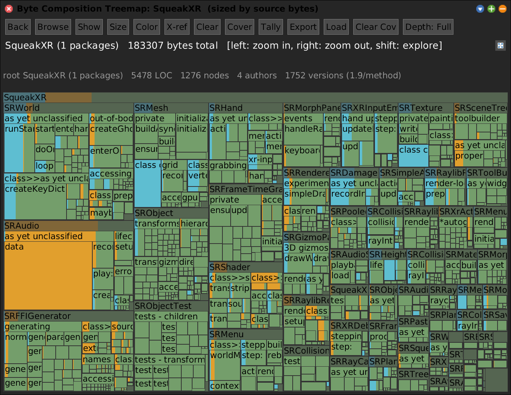
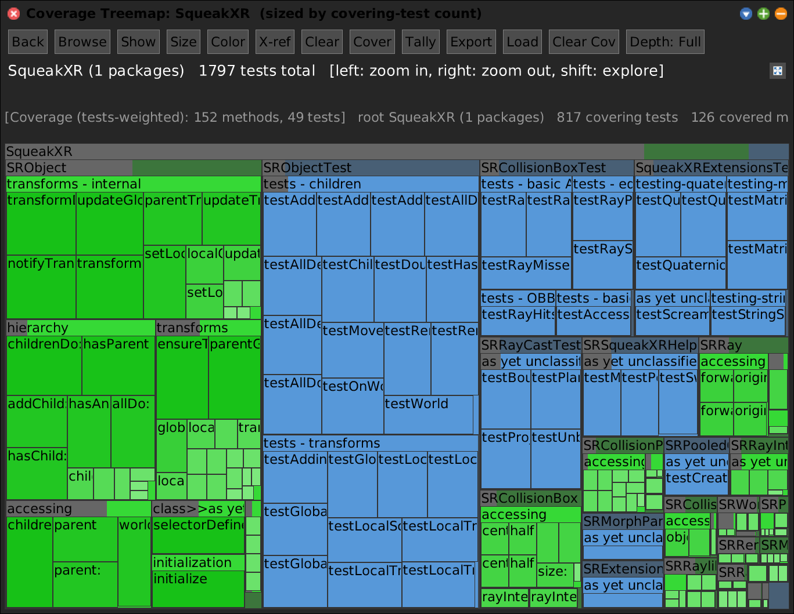
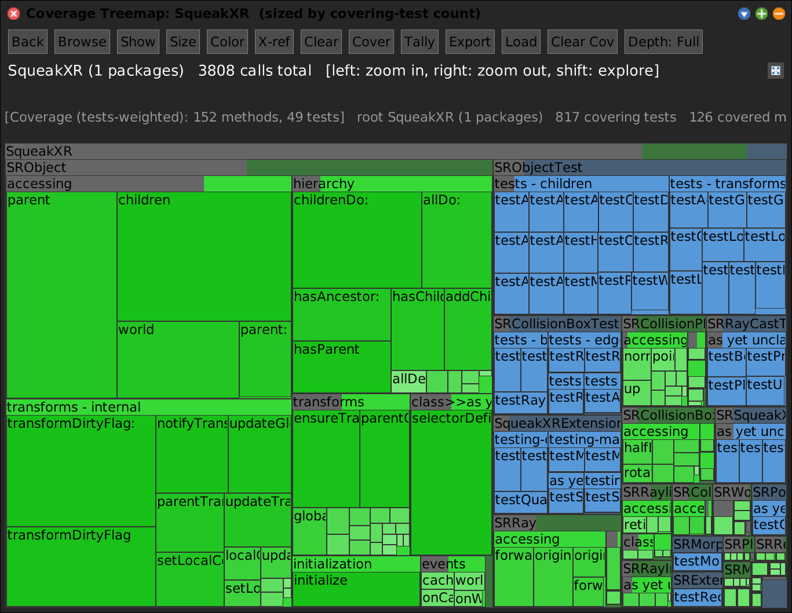
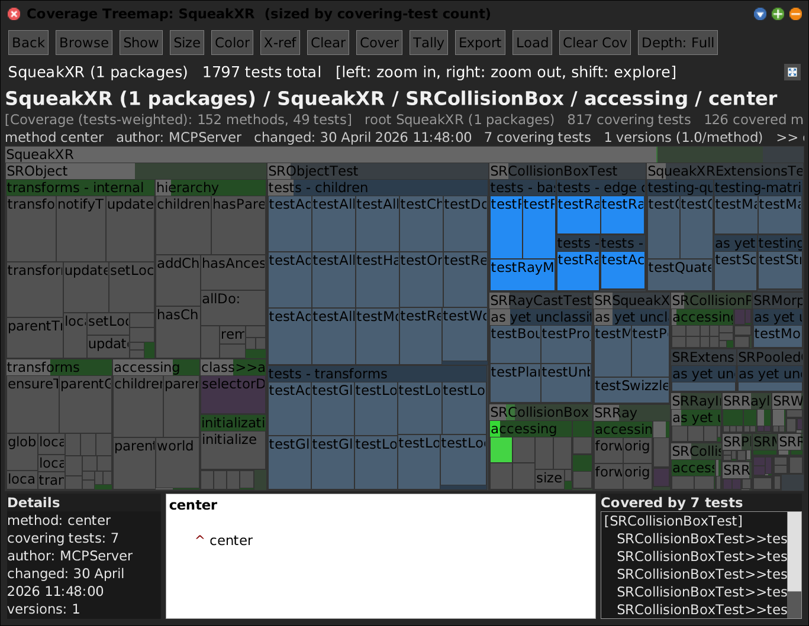

# SWACodeMap -- Static Code-Structure Treemap for Squeak


## Motivation

Where **SWASpaceTally** answers *"where does the memory go?"* by walking the live
object graph, the **Code Map** answers the static, source-side question: *"what is
the shape of this code, and where is the weight?"* It renders a package's
`package -> class -> category -> method` tree as a squarified treemap, where each
tile's **area** is a metric you choose (lines of code, source bytes, method count,
or -- with profiling data -- execution counts) and each tile's **colour** is an
orthogonal property you choose (kind, author, recency, churn, or the
documentation/string/code composition).

Because area and colour are independent and both switch live, one map answers many
questions: *which classes are large? which are comment-heavy? who last touched the
hot code? which methods did the tests actually exercise, and how often?*

All examples below use the **SqueakXR** package (74 classes, ~980 methods) and a
coverage data set generated from its own SUnit tests.

```smalltalk
SWAPane openOnPackageNamed: 'SqueakXR' leafKind: #class.
```



<!-- SCREENSHOT codemap-default-loc-kind.png
| w |
w := SWAPane openOnPackageNamed: 'SqueakXR' leafKind: #class.
World displayWorld. (Delay forMilliseconds: 500) wait. World displayWorld. (Delay forMilliseconds: 200) wait.
PNGReadWriter putForm: w imageForm onFileNamed: 'codemap-default-loc-kind.png'.
w delete.
-->

The header chrome -- **Back / Browse / Show / Data / Tree / Size / Color / Links /
Tally / Export / Load / Depth** -- is shared with the other SWA treemaps via
`SWAPane`. The two-line info area below shows whole-run info and the current
selection.

There is no longer a dedicated **X-ref / Clear** button pair. Cross-referencing
another open view is now just an entry in the **Data** menu: every open peer
treemap/flamegraph appears there as "X-ref: `<window>`", and picking it colours
this map by that peer's per-key weight (a `#peer` `SWADataset`) -- so a
cross-reference mixes and matches like any loaded dataset, and picking **None**
clears it. The dataset mechanism itself moved down to the shared `SWAView`, so
*every* SWA tool (Code Map, Space Tally, and any peer) can host datasets and be a
cross-reference source or colour target uniformly.


## One Tool, Many Modes

The Code Map is a *single* tool. The various `open...` class methods are just
**presets** that preconfigure two live-switchable settings -- the **size metric**
and the **colour mode** -- and optionally load a coverage file. Everything they set
is reachable at runtime from the **Size** and **Color** header buttons (and the
right-click context menu), so you can move between any two modes without reopening:

| Opener | Size metric | Colour mode | Coverage data |
|---|---|---|---|
| `openOnPackageNamed:leafKind:` | LOC | by kind | -- |
| `openByteCompositionOnPackageNamed:` | source bytes | byte composition | -- |
| `openCoverage:onPackageNamed:` | covering-test count | coverage overlay | loaded |
| `openInvocations:onPackageNamed:` | invocation count | coverage overlay | loaded |

The only constraint is that the two **execution** size metrics (call count /
covering tests) need a coverage data set present, so they appear in the Size menu
only after one is loaded (via the opener or the **Load** button).


## Size: what the tile AREA means

Right-click -> **Size**, or the header **Size** button (always reachable, even if a
metric collapses the map to empty). The size metric is a rolled-up weight: an
aggregate tile is the sum of its descendants.



<!-- SCREENSHOT codemap-size-menu.png (captures a Display REGION so the popped-up menu is included)
| w panel overlay menu rect form |
w := SWAPane openByteCompositionOnPackageNamed: 'SqueakXR' leafKind: nil.
panel := w allMorphs detect: [:m | m isKindOf: SWAPane].
overlay := panel treemapOverlay.
World displayWorld. (Delay forMilliseconds: 300) wait.
menu := overlay sizeMenuMorph.
menu popUpAt: (w position + (300@95)) forHand: World activeHand in: World.
World displayWorld. (Delay forMilliseconds: 300) wait.
rect := w bounds.
form := Form extent: rect extent depth: 32.
form copy: (0@0 extent: rect extent) from: rect origin in: Display rule: Form over.
PNGReadWriter putForm: form onFileNamed: 'codemap-size-menu.png'.
menu delete. w delete.
-->

- **Number of methods** -- tiles sized by how many method leaves they contain.
  Pure "how much API is here", ignoring method length.
- **Lines of code** -- non-blank source lines (the default).
- **Source byte size** -- raw source-text byte size. Slightly different from LOC:
  long lines, heavy comments, and big string literals weigh more than line count
  alone suggests. Pairs naturally with the byte-composition colour (below).
- **Execution: call count** -- how many times each method actually ran during a
  profiled test run (raw invocation count). *Requires coverage data.*
- **Execution: covering tests** -- how many distinct tests exercised each method.
  *Requires coverage data.*

Uncovered methods have zero execution weight, so the two execution metrics collapse
untested code to nothing and show -- proportionally -- only what ran.


## Color: what the tile COLOUR means

Right-click -> **Color**, or the header **Color** button. Recolouring is **instant**
(no relayout -- only the cached image is redrawn), so you can flip through colour
modes on a fixed layout.

- **By kind** -- package / class / category / method (and a distinct teal for
  class-comment nodes, purple for class-side methods). The structural default.
- **By byte composition** -- the doc/string/code bar (see below).
- **By LOC (heat)** -- green (small) to red (large), log-scaled.
- **By avg LOC / method** -- average method length, surfacing classes of long methods.
- **By avg versions / method** -- change churn from the `.changes`/`.sources` history.
- **By recency (last changed)** -- newest code brightest.
- **By author (last changed)** -- a hue per author.







<!-- SCREENSHOT codemap-color-loc-heat.png / codemap-color-author.png / codemap-color-recency.png
| w tm cap |
w := SWAPane openOnPackageNamed: 'SqueakXR' leafKind: #class.
tm := w allMorphs detect: [:m | m isKindOf: SWACodeTreemapMorph].
cap := [:name | World displayWorld. (Delay forMilliseconds: 400) wait. World displayWorld. (Delay forMilliseconds: 200) wait.
	PNGReadWriter putForm: w imageForm onFileNamed: name].
tm colorMode: #loc.     cap value: 'codemap-color-loc-heat.png'.
tm colorMode: #author.  cap value: 'codemap-color-author.png'.
tm colorMode: #recency. cap value: 'codemap-color-recency.png'.
w delete.
-->


## Byte Composition: documentation / strings / code

Selecting **Color -> By byte composition** (or the `openByteComposition...` preset)
paints, inside every method tile, a horizontal proportional bar splitting the
method's source bytes into three lexical buckets:

- **teal** -- documentation (method-comment bytes),
- **amber** -- string-literal bytes,
- **green-gray** -- the rest (code).

```smalltalk
SWAPane openByteCompositionOnPackageNamed: 'SqueakXR' leafKind: nil.
```



<!-- SCREENSHOT codemap-byte-composition.png
| w |
w := SWAPane openByteCompositionOnPackageNamed: 'SqueakXR' leafKind: nil.
World displayWorld. (Delay forMilliseconds: 500) wait. World displayWorld. (Delay forMilliseconds: 200) wait.
PNGReadWriter putForm: w imageForm onFileNamed: 'codemap-byte-composition.png'.
w delete.
-->

This is most useful sized by **Source byte size** (the preset's default), so a
method's tile area *is* its byte size and the bar splits that area -- but size and
colour are independent, so you can keep any size metric and just turn the bar on.
Aggregate tiles (class, category) roll the composition up over their methods; when a
tile is too small to show its method children the bar still conveys the mix, the
same fallback the coverage overlay uses.

The **class comment** is a first-class node in the tree (a teal `class comment`
leaf, sibling to the method categories), so a class's prose documentation has its
own measurable tile -- entirely documentation bytes.

### Implementation: the lexical classifier and its cache

A single left-to-right state machine (`SWACodeMethodNode class>>classifyBytes:`)
charges every source character to comment / string / code, honouring Smalltalk's
quoting rules (`""` and `''` escapes, `$'` character literals, a quote inside the
other kind of region). Parsing is more expensive than counting lines, so results
are cached in a **weak dictionary keyed on the `CompiledMethod`**
(`SWACodeMethodNode class>>byteAnalysisCache`). The entry survives tree rebuilds
(each reopen builds fresh transient nodes) yet is collected automatically when a
method is recompiled or removed -- no manual flushing -- and is validated against
the current source length so a stale entry can never mis-sum.


## Coverage: which tests exercised which methods

The Code Map doubles as a **test-coverage** viewer. A `SWACoverageData` set records,
for each method, which tests covered it and how many times it was called; it is
persisted as image-independent `Class>>selector`-keyed JSON. Generate one for a
package and its tests:

```smalltalk
SWACoverage generatePackages: #('SqueakXR')
    tests: (SWACoverage testClassesForPackages: #('SqueakXR'))
    toFile: 'squeakxr-coverage.json'.
```

### Coverage overlay

Loading the data (the **Load** button, or `showCoverageData:`) tints the map:
**green** covered methods (graded by the metric), **blue** executed tests and
TestCase classes, **red** methods evicted during the run, gray untouched. Aggregate
tiles get a proportional green/red/blue/gray bar summarising their leaves. The
overlay works on *any* size metric -- here on a LOC-sized structural layout:


<!-- SCREENSHOT codemap-coverage-overlay-on-loc.png (overlay tint on a LOC-sized layout)
| w tm |
w := SWAPane openOnPackageNamed: 'SqueakXR' leafKind: nil.
tm := w allMorphs detect: [:m | m isKindOf: SWACodeTreemapMorph].
tm showCoverageData: (SWACoverageData fromFile: 'squeakxr-coverage.json') weightMode: #tests.
(w allMorphs detect: [:m | m isKindOf: SWAPane]) treemapCoverageStatus: 'Coverage overlay on LOC-sized map'.
World displayWorld. (Delay forMilliseconds: 500) wait. World displayWorld. (Delay forMilliseconds: 200) wait.
PNGReadWriter putForm: w imageForm onFileNamed: 'codemap-coverage-overlay-on-loc.png'.
w delete.
-->

### Coverage-weighted layout

`openCoverage:onPackageNamed:` additionally *sizes* tiles by covering-test count, so
untested code collapses and the map shows, proportionally, what the tests
exercised:

```smalltalk
SWAPane openCoverage: 'squeakxr-coverage.json' onPackageNamed: 'SqueakXR'.
```



Switch the Size metric to **Execution: call count** for raw invocation counts (or
use `openInvocations:onPackageNamed:`):



<!-- SCREENSHOT codemap-coverage-tests-weighted.png + codemap-coverage-invocations-weighted.png
| w tm cap |
w := SWAPane openCoverage: 'squeakxr-coverage.json' onPackageNamed: 'SqueakXR' leafKind: nil.
tm := w allMorphs detect: [:m | m isKindOf: SWACodeTreemapMorph].
cap := [:name | World displayWorld. (Delay forMilliseconds: 400) wait. World displayWorld. (Delay forMilliseconds: 200) wait.
	PNGReadWriter putForm: w imageForm onFileNamed: name].
cap value: 'codemap-coverage-tests-weighted.png'.
tm weightMetric: #invocations.
cap value: 'codemap-coverage-invocations-weighted.png'.
w delete.
-->

### Provenance on selection

Press **Show** to reveal the bottom row: a **Details** box (left), the **source**
pane (center, Shout-highlighted), and a **Covered by N tests** pane (right) listing
the tests that exercised the selected method. Selecting a method green-filters the
map to it; selecting a test blue-filters to the methods it covered.



<!-- SCREENSHOT codemap-show-source-details.png (selects a covered method, then opens the Show row)
| w tm panel data leaf |
data := SWACoverageData fromFile: 'squeakxr-coverage.json'.
w := SWAPane openCoverage: 'squeakxr-coverage.json' onPackageNamed: 'SqueakXR' leafKind: nil.
tm := w allMorphs detect: [:m | m isKindOf: SWACodeTreemapMorph].
panel := w allMorphs detect: [:m | m isKindOf: SWAPane].
leaf := nil.
tm rootNode withAllChildrenDo: [:n |
	(leaf isNil and: [(n isKindOf: SWACodeMethodNode) and: [(data coveringTestCountFor: n crossRefKey) >= 2]])
		ifTrue: [leaf := n]].
tm selectTileNode: leaf.
panel toggleSource.
World displayWorld. (Delay forMilliseconds: 500) wait. World displayWorld. (Delay forMilliseconds: 200) wait.
PNGReadWriter putForm: w imageForm onFileNamed: 'codemap-show-source-details.png'.
w delete.
-->


## Datasets: the Data menu

Coverage is one instance of a general mechanism. The **Data** header button (and
the right-click **Data** submenu) is the Code Map's primary overlay entry point: it
lists **None (intrinsic)**, one entry per **retained, named dataset**, then -- below
separators -- the **Mask** combinator, the async **Generate** entries, and any open
**peer** views. Picking a dataset makes it active and applies its *fitting defaults*
across the axes (colour / size / decoration); each axis can still be overridden
afterward from its own menu, and the override sticks until the next Data pick.

A dataset is a named, retained, image-independent (`crossRefKey`-keyed) overlay. Each
carries one or more **metrics** bindable to colour, size, or links -- so one loaded
coverage file yields *both* a *By coverage* and a *By call* metric, and loading the
same kind twice gives two coexisting, instantly-switchable entries (`coverage_1`,
`coverage_2`). See [architecture.md](architecture.md) §6 for the full model.

Datasets arrive four ways:

- **Load** (a file) -- the `Load` button / `importData` opens a `*.json` chooser and
  dispatches by content marker: coverage, duplication, topic, or space-tally JSON.
- **Generate** (compute on the fly) -- the italic entries under Data, the async twins
  of Load (below).
- **Mask** (combine two datasets) -- the `B \ A` combinator (below).
- **Peer** (another open view) -- every open treemap/flamegraph appears as
  "X-ref: `<window>`"; picking it colours this map by that peer's live per-key weight
  (`SWAPeerViewSource`). This replaced the former X-ref/Clear buttons.

### Generate: compute a dataset without leaving the map

The italic **Generate** entries compute analysis data for the *shown packages* and
retain the result as a dataset (so it then behaves like a loaded file):

| Entry | What it runs | Sync/async |
|---|---|---|
| **Generate: duplication (clone heat)** | inverted-shingle Jaccard scan | forked at background priority |
| **Generate: test coverage (run related tests)** | SUnit-with-provenance run, Stop-able | forked behind a Stop window |
| **Generate: call tally (instrument + exercise, then Stop)** | live invocation counting | two-phase: instrument -> exercise -> STOP collects |
| **Generate: sample tally (Ns CPU heat)** | external st-spy sampler on this image | async; `whenReadyDo:` installs it |
| **Generate: topic model (k=N)** | Biterm Topic Model over the methods | forked at background priority |

**Call Tally is two-phase.** Picking it instruments every shown method with
self-evicting wrappers and pops a small **STOP** window; you exercise the system so
calls are counted, then STOP collects the counts, uninstalls the wrappers, and
retains the result as a `#call`-metric dataset (which can additionally carry a
captured flamegraph call tree -- see
[SWAMessageTally.md](SWAMessageTally.md#deterministic-call-tree-capture-swatallywrapper)).
Closing the pane or the STOP window abandons the tally and sweeps *all* stray
wrappers, so instrumentation never lingers to corrupt unrelated tools.

The whole-image class-side generators write JSON to auto-named files and re-open a
Code Map on the result: `SWAPane generateSqueakCoverageJson` (forks a throwaway
**headless child image** so this image is never touched by broken/looping tests),
`generateSqueakDuplicationJson`, `generateSqueakTopicJson`. The sample-tally
duration and topic `k`/sweeps are Preferences-configurable
(`SWAPane class>>sampleTallyDuration`, `topicK`, `topicSweeps`).

### Mask: `B \ A` -- what's new in one run vs another

With two mask-eligible datasets loaded (call tally / coverage / other masks), the
**Mask (B \ A)** entry set-subtracts them: pick a baseline **A**, then an overlay
**B**, and the mask highlights the method keys touched in **B but not A** -- the Code
Map analog of the Space Tally's "Diff from this". Crucially the mask **mirrors B's
metrics gated to the survivor set**, so you keep *By call* / *By coverage* / *By
bytes* and choose which drives colour (survivors carry B's *real* values, not a flat
boolean). The algebra closes: a mask can itself be an operand of another mask.
Currently the only operator is `#minus` (intersection/union are open ends --
[smells.md](smells.md) §6.3).

## Duplication: near-clone detection

Load a duplication JSON (or **Generate: duplication**) to surface copy-paste /
near-clone clusters. The engine (`SWACodeSimilarity`) represents each method's source
as a **set of k-gram shingles** (k=4) and scores a pair by the **Jaccard
coefficient** `|A∩B| / |A∪B|`: a verbatim copy scores 1.0, a copy with one changed
line still scores high, paraphrase/renaming defeats it (the known set-method
weakness). The live scan (`computeDuplicationScores`) uses an **inverted shingle
index** so only candidate pairs sharing ≥1 k-gram are compared -- *exact* results
(two methods with no shared shingle have Jaccard 0), ~13x faster than brute force.
Trivial methods (< `dupMinLoc`, default 4) are skipped as noise.

### Colour, bars, and links

- **Colour by duplication** -- method leaves get a heat ramp on their max Jaccard
  score (cool slate when unique; yellow -> orange -> red as a match approaches an
  exact copy). Aggregate tiles get a proportional **"% of methods duplicated" bar**,
  tinted by the average clone strength of the affected methods.
- **Clone links** (the **Links** / decoration axis) -- lines drawn between duplicated
  method tiles. **Colour** encodes the Jaccard score (yellow weak -> red exact);
  **width** encodes the *shared-LOC impact* (score × the smaller method's LOC, log-
  scaled) -- so a genuinely copied 40-line method draws a heavy line while dozens of
  near-identical one-line accessors stay thin. Each line gets a dark casing so it
  stays visible over any tile colour. Links are filtered to the current selection's
  subtree (a method shows its own partners; a container shows links with one endpoint
  inside it; nothing selected shows the whole-map overview). Off-screen partners
  resolve to their nearest visible ancestor, or (via `SWADuplicationPartnerStub`) are
  listed but not drawn.

### Diff side-pane

Under a duplication dataset the **Covered by** side-pane becomes a **duplicates**
pane. Selecting a *method* lists its near-duplicates (`NN%  partner`); selecting a
*container* aggregates the near-duplicate **pairs** under it (`NN%  a <-> b`, best-
first, top 50). Clicking an entry shows the **inline diff** of the two methods
(styled removed/inserted lines via `TextDiffBuilder`) in the Source pane -- and for a
container browse it does so **without changing the primary selection**, so the list
survives and you can step through it; the partner tile gets a red secondary-selection
border.

## Topic model: what each method is *about*

Load a topic JSON (or **Generate: topic model**) to tint methods by their inferred
**topic**. The model (`SWABitermTopicModel`) is a **Biterm Topic Model** (Yan et al.
2013) fit in-image: it tokenises each method's source (camelCase-split, Smalltalk
stopwords dropped), forms the corpus as a bag of **biterms** (co-occurring word
pairs -- robust for short texts, which method bodies are), runs collapsed Gibbs
sampling, then collapses the `k` topics into a smaller number of **hue families** by
top-word overlap. The result (`SWATopicData`) is image-independent
(`Class>>selector`-keyed) JSON. Topics can optionally be given short **LLM labels**
(`labelTopicsWithLlm...`, via a local Ollama endpoint).

- **Colour by topic** -- each method leaf takes its dominant topic's **hue family**
  colour, brightness = confidence; aggregate tiles get a proportional **topic-mixture
  bar** (one segment per topic in the subtree, widest = dominant).
- **Focus a single topic** -- clicking a topic in the side-pane recolours the *whole
  map* by that one topic's **weight heat** (one hue, faded by each node's share of
  it) and shows the topic's top raw words in the Details box; clicking again clears
  the focus.
- The side-pane lists the selection's topic mixture (or, with nothing selected, the
  overall topics by prevalence); the title shows the dominant topic's label.

Generate a file directly:
```smalltalk
((SWABitermTopicModel onPackageNamed: 'Morphic') buildAndRun: 200)
    writeToFile: 'morphic-topics.json'.
```

## Marks: cross-view bookmarks

Any tile can be **bookmarked** (shift-click, or the context menu). Marks are stored
as cross-view `markKey`s (package name / class name / `'Class>>selector'`) in a
process-wide singleton `SWAMarkSet`, so a mark set in *any* SWA view lights up (green
border) in *every* open view that contains it. The left **Marks** flap lists them
with a per-mark **comment** editor and an **origin** panel (where the mark was made:
view kind, dataset, package scope). Marks persist to a JSON sidecar
(Save/Load in the flap's burger menu) and survive window open/close.

From the marks burger menu, **Class diagram of marks (live)** opens a
[Class Diagram](gallery.md#class-diagram--inheritance-diagram) scoped to exactly the
marked classes, in the `+Selected` granularity (each box shows only its *marked*
ivars and methods), staying **live-synced** as you mark/unmark elsewhere.

## Architecture

### The node tree (`SWANode` / `SWACodeNode`)

The data model is a tree of `SWACodeNode`s, sharing the `SWANode` contract
(`parent`/`children`, `depth`, `pathString`, `crossRefKey`) with the Space Tally and
Sampling Tally node types.

```
SWANode
  SWACodeNode
    SWACodeRootNode           -- aggregates one or many packages (glob-matched)
      SWACodeMarkSetRootNode  -- children = the currently-marked classes (live diagram)
    SWACodePackageNode        -- a package (nests sub-packages; resolves category ownership)
    SWACodeClassNode          -- a class (builds a comment node + category children;
                                 owns the Graphviz record-box / UML compartment emission)
    SWACodeCategoryNode       -- a method category (instance- or class-side / static)
    SWACodeMethodNode         -- a method leaf (source/LOC/byte metrics, all cached)
      SWACodeCommentNode      -- the class comment as a leaf (100% documentation)
    SWACodeInstVarNode        -- an instance variable, keyed 'Class>>#ivar' (markable;
                                 composition/type EDGES to other nodes are a stubbed,
                                 not-yet-built future overlay -- see smells.md §6.5)
```

Children are built lazily; per-method metrics (`loc`, `byteSize`, `byteComposition`,
`changeCount`, `lastAuthor`, ...) are cached on the node.

**Parent-chain inherited attributes.** Five separate settings resolve *up the parent
chain*, so they need only be set on the **root** and every lazily-built descendant
sees them: `weightMetric` (intrinsic size), `sizeMetric` (a dataset-driven size),
`coverageData` + `coverageWeightMode`, and `topicData`. Each also keeps its own
rolled-up cache (`rollupLoc`, `rollupBytes`, `rollupCoverage`, `rollupDataset`,
`rollupMethodCount`, `rollupTopic`) with its own flush, so switching size metrics is
a fast relayout, never a re-walk. `SWACodeNode>>totalSize` is the single dispatch
point that maps whichever size setting is active to the right rolled-up weight
(`sizeMetric` dataset weight > `#invocations`/`#tests` coverage weight >
`#methods`/`#bytes`/`#loc`). (These five near-identical inheritance mechanisms are a
noted dedup candidate -- [smells.md](smells.md) §4.6.)

Reading source from the `.changes`/`.sources` file is the one genuinely expensive
step, so each method's source string is read once and held on the node; LOC and the
byte analysis derive from that cached string.

### The view (`SWAView` / `SWATreemapMorph` / `SWACodeTreemapMorph`)

The treemap morph subclasses the shared `SWAView` (selection, cross-ref key index,
cached-Form rendering) and `SWATreemapMorph` (squarified layout, zoom in/out, the
`drawTileContent:in:on:` hook). `SWACodeTreemapMorph` supplies the code-specific
colour palettes and overrides `drawTileContent:` to paint the byte-composition and
coverage bars.

**Size vs colour are deliberately decoupled.** Changing the colour mode flushes only
the cached Form (instant redraw); changing the size metric invalidates the layout and
re-lays-out, keeping the current zoom and selection. This is why "recolouring is
instant" while "resizing reflows".

**Two coverage paths coexist (editor beware).** The `SWADataset`-based coverage path
(described above) is *additive*: it was layered on top of an older single-ivar
coverage overlay (`showCoverage:`, `showCoverageData:weightMode:`, the legacy
`#coverage` / `#tally` colour modes, `enterCoverageColorMode` /
`enterTallyColorMode`, and the `coverageData` / `coverageKind` ivars on the view).
Both are live and interact in `intrinsicColorForNode:` -- so any change to coverage
colouring must keep them consistent. Retiring the legacy overlay in favour of pure
datasets is the single largest piece of structural debt
([smells.md](smells.md) §3.2).

### The chrome (`SWAPane`) and the menus

`SWAPane` wraps the morph with the shared header. The **Size** and **Color**
buttons and the right-click context menu are driven by a *single* menu source
(`SWATreemapOverlay>>sizeMenuMorph` / `colorMenuMorph`), so the header buttons and
the context menu can never drift apart. The header buttons exist because a size
metric can legitimately collapse the map to an empty canvas (e.g. call-count sizing
when nothing in scope was covered) -- the tile-based right-click menu would then be
unreachable, but the buttons never are. **Clear Cov** also reverts a dynamic size
metric back to LOC so clearing coverage can't strand you on an empty map.


## Cross-Referencing via the Data menu

Like the Space Tally and Sampling Tally, the Code Map speaks the shared `crossRefKey`
vocabulary (class names are unique; methods are `'Class>>selector'`). Cross-
referencing another open view is no longer a dedicated button: every open peer
treemap/flamegraph appears in the **Data** menu as "X-ref: `<window>`". Picking one
wraps that peer as a `#peer` `SWADataset` (`SWAPeerViewSource` reads the peer's live
`keyIndex`, weighting by each node's `totalSize`) and colours this map by it -- so
it mixes and matches with loaded datasets like any other, and **None** clears it.

Container tiles aggregate: a class (or package) tile is coloured by the summed
weight of its matching descendants (`SWADatasetMetric>>valueForNode:` rolls up when
a node's own key has no value). So highlighting *which methods a live profiler
sampled* also lights up the classes and packages that own them, even though the
peer is keyed at method granularity. And a Space Tally can equally colour a Code
Map (per-class bytes) -- the same path, no special case.


## Quick Start

From the world menu: **open... -> Code Map**, or:

```smalltalk
"Static structure, sized by LOC, to the class level."
SWAPane openOnPackageNamed: 'SqueakXR' leafKind: #class.

"Down to methods, sized + coloured by source byte composition."
SWAPane openByteCompositionOnPackageNamed: 'SqueakXR'.

"Test coverage, sized by covering-test count."
SWAPane openCoverage: 'squeakxr-coverage.json' onPackageNamed: 'SqueakXR'.

"Test coverage, sized by raw invocation count."
SWAPane openInvocations: 'squeakxr-coverage.json' onPackageNamed: 'SqueakXR'.
```

`leafKind:` stops *rendering* at a given level (`#package` / `#class` / `#category`
/ `#method`); the full tree and all roll-ups are still built. With a broad glob
(`'*'`) use `#class` to avoid tiling tens of thousands of method nodes.


## Regenerating the Screenshots

Each image above is followed by an HTML comment containing the exact Smalltalk that
produced it. The snippets use bare relative file names; they resolve against the
image's working directory (`FileDirectory default`), so either evaluate them from a
`doc/`-rooted image or prepend the `doc/` path to each file name. They all assume the
coverage data file `squeakxr-coverage.json` sits next to the images; regenerate it
first with:

```smalltalk
SWACoverage generatePackages: #('SqueakXR')
    tests: (SWACoverage testClassesForPackages: #('SqueakXR'))
    toFile: 'squeak-object-space-tally/doc/squeakxr-coverage.json'.
```

The captures use a fixed window size (`SWAPane class>>defaultWindowBounds`,
`568@205 corner: 1935@1264`) so the full button bar fits on one row and the map does
not overflow; on a smaller display the window is clipped to the screen and the button
bar wraps onto extra rows.


## See Also

- **[SWASpaceTally](SWASpaceTally.md)** -- structural memory analysis (the sibling
  treemap over the live object graph).
- **SWAMessageTally** -- the Sampling Tally: a statistical message-tally profiler
  and flamegraph (driven by the external st-spy sampler), documented separately.
- **[index](index.md)** -- the shared SWA tools index.
