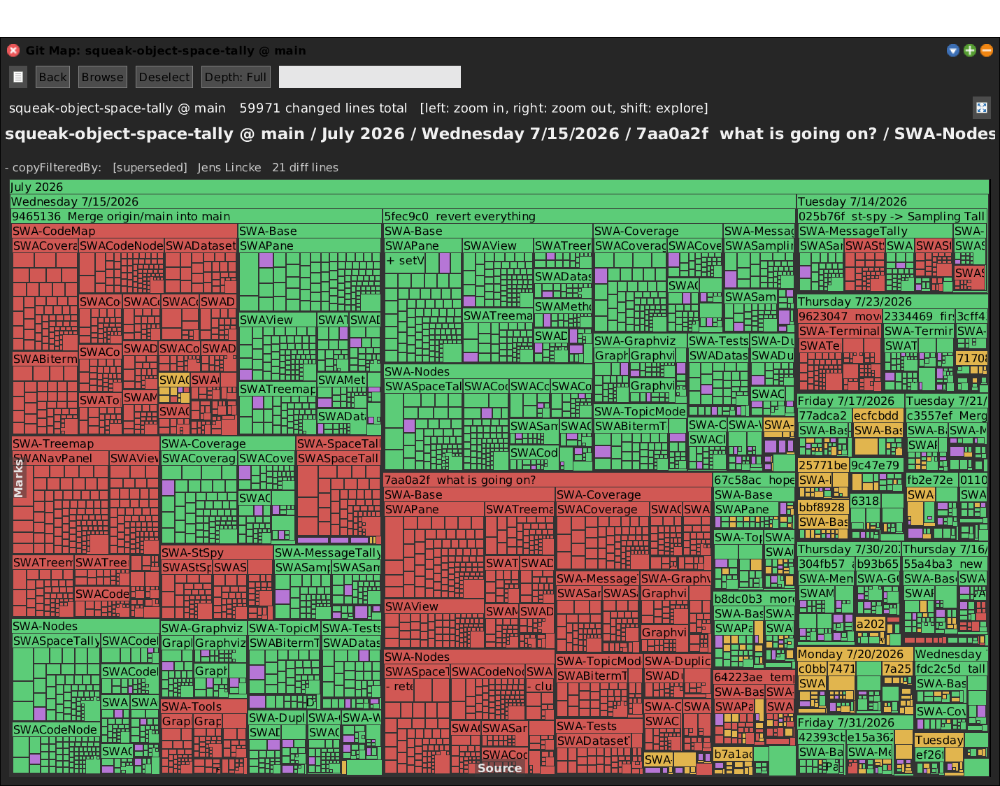
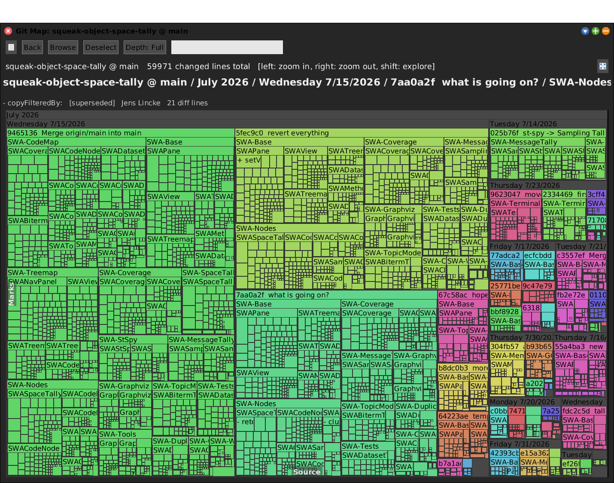
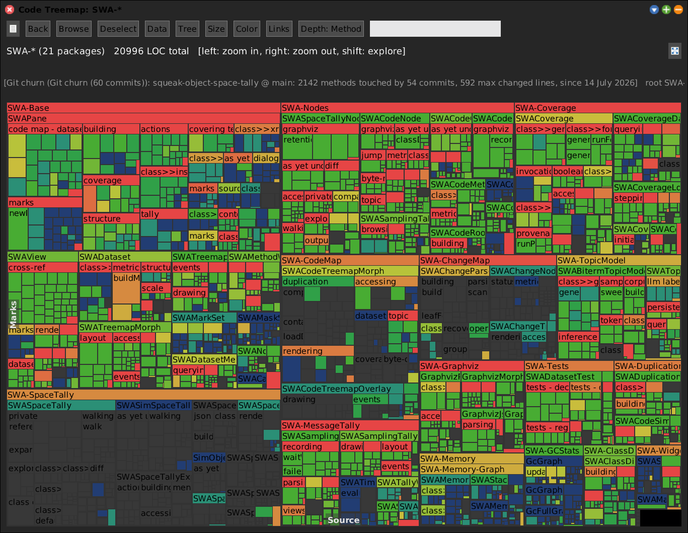
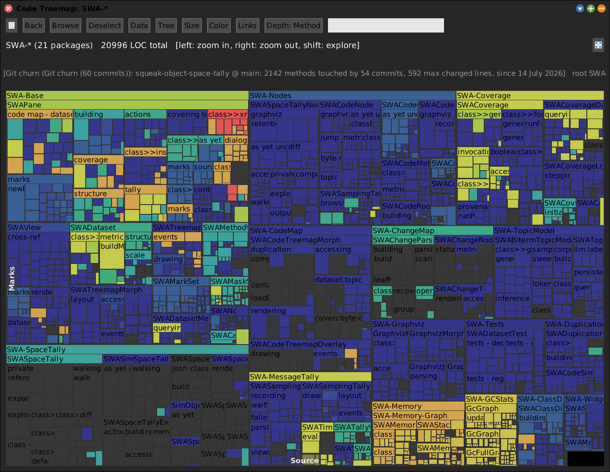

# SWAGitMap -- Git History as a Treemap, and as a Code Map Overlay


## Motivation

The **Change Map** reads the image's own `.changes` file and answers *"when did the
code change?"*. That is the right question, asked of the wrong artefact: the changes
file is a per-image log, it is not what anyone reviews, and it knows nothing about
branches, commits or authorship.

Squeak has real version control in the image -- **GitS** -- and GitS already knows
how to turn a pair of commits into Monticello patch operations. So the same picture
can be drawn from the repository instead, at **method granularity**, with no text
diffing and no shelling out to `git`.

The tool has **two halves**, and the second one is the point:

| | Question | Laid out by |
|---|---|---|
| **Git Map** (`SWAGitHistory`) | What did these commits change? | **time** -- month / day / commit |
| **Git churn dataset** (`SWAGitChurnData`) | What has been churning, and how recently? | **code structure** -- projected onto the Code Map |

Both come out of a *single* scan. The Git Map builds a tree; folding that same tree
down to one record per method gives the dataset. Because it is keyed by the shared
`crossRefKey` (`'Class>>selector'`), it composes with coverage, duplication, space
tally and marks like any other `SWADataset` -- which is the algebra
[ideas.md](ideas.md) argues for, with git history as the provenance axis.

```smalltalk
"World menu: open... -> SWA Git Map, or:"
SWAGitHistory openLastCommits: 60.
```


## Half 1: the Git Map



<!-- SCREENSHOT gitmap-operation.png
| hist root w |
hist := (SWAGitHistory onWorkingCopyNamed: 'squeak-object-space-tally') maxCommits: 60; yourself.
root := hist buildTreeProgress: nil.
w := hist openTreemapForRoot: root.
World displayWorld. (Delay forMilliseconds: 500) wait. World displayWorld.
PNGReadWriter putForm: w imageForm onFileNamed: 'media/gitmap-operation.png'.
w delete.
-->

### The tree

```
root (repo @ branch)
  month
    day
      commit          "abbreviated hash + subject, as in git log --oneline"
        package       "the Monticello package, read from the commit"
          class
            change    "one changed method"
```

Leaf **area is diff size in changed lines**, not method length -- so a one-word fix
is a sliver and a rewrite is a slab. The baseline each leaf is measured against is
exact, and this is where git beats the changes file:

- **modified** -- diffed against `MCModification>>obsoletion`, the byte-exact body
  as of the parent commit;
- **added** -- weighs its whole body (no baseline exists);
- **removed** -- weighs the body it deleted.

### Colour modes

Right-click -> **Color**, or the header **Color** button.

- **By operation** *(default)* -- green added, amber modified, red removed; purple
  for class definitions. A container takes the operation accounting for the most
  **changed lines** beneath it, so its colour is weighted the same way its area is.
- **By commit** -- a stable hue per commit hash, so one commit's footprint is
  recognisable wherever it landed across packages and classes.

  

- **By package** -- a stable hue per Monticello package.
- **By author**, **By recency** -- as in the Change Map.
- **By status vs image** -- the provenance question the Change Map asks, now asked
  of the repository: is this commit's version of the method *still what my image
  has* (`#current`), was it later overwritten (`#superseded`), is it in the method's
  version history (`#inHistory`), or **gone**? A **removal** is a real, checkable
  claim here, so `SWAGitNode>>computeStatusSymbol` answers `#gone` when the deletion
  took and `#other` when the method is still in the image -- i.e. *the image has
  drifted from the repository*.

### Selecting a change

Press **Show** for the bottom row. A selected method change shows its **inline
diff** against the parent commit (`TextDiffBuilder`-styled, Shout suppressed), and
the Details box carries the operation, package, commit hash and subject. The tile
context menu adds *browse current version*, *browse commit NNNNNNN in Git Browser*
(the GitS compare-to-parent dialog) and *copy commit hash*.

### Merges

A commit is diffed against its **first parent** only -- the same convention as
`git log --first-parent -p`. So a merge tile shows what the merge *brought in*
relative to the branch it landed on. That is usually what you want, and it is also
why a `Merge origin/main into main` can be the largest tile on the map.


## Half 2: git churn on the Code Map

Fold the scan down to one record per method and the same history can be drawn on the
**code** instead of on the calendar.



Dark gray is code the window did not touch; blue is one commit; the ramp runs
green -> yellow -> red as a method is rewritten again and again.

The **recency** metric is the one that reads fastest -- it shows at a glance which
corners of the system are alive and which have not moved in weeks:



<!-- SCREENSHOT gitmap-churn-on-codemap.png + gitmap-recency-on-codemap.png
| hist root data w panel tm m |
hist := (SWAGitHistory onWorkingCopyNamed: 'squeak-object-space-tally') maxCommits: 60; yourself.
root := hist buildTreeProgress: nil.
data := SWAGitChurnData fromGitTree: root. data repositoryName: hist rootLabel.
w := SWAPane openOnPackageNamed: 'SWA-*' leafKind: #method.
panel := w allMorphs detect: [:x | x isKindOf: SWAPane].
tm := panel treemap.
panel addGitChurnDataset: data name: 'Git churn (60 commits)'.
World displayWorld. (Delay forMilliseconds: 500) wait. World displayWorld.
PNGReadWriter putForm: w imageForm onFileNamed: 'media/gitmap-churn-on-codemap.png'.
m := tm metricsByMode detect: [:x | x id == #gitRecency].
tm colorMode: m modeSymbol.
World displayWorld. (Delay forMilliseconds: 500) wait. World displayWorld.
PNGReadWriter putForm: w imageForm onFileNamed: 'media/gitmap-recency-on-codemap.png'.
w delete.
-->

### The four metrics

A `#gitChurn` dataset exposes four metrics, switchable instantly from the **Color**
menu without rescanning:

| Metric | Raw value | Rollup | Why that rollup |
|---|---|---|---|
| **By commits** *(default)* | commits touching this method | `#sum` | a class's churn *is* its methods' churn |
| **By changed lines** | total diff lines over the window | `#sum` | same |
| **By recency of last commit** | seconds of the most recent change | `#max` | "when was this last touched" is the *most recent* touch, not a sum of timestamps |
| **By number of authors** | distinct author names | `#max` | summing would count the same person once per sibling method |

### Getting one

Three ways, all landing in the same place:

```smalltalk
"1. From an open Code Map: Data -> Generate: git churn (scan a repository's commits).
    Asks for the repository and depth, then scans FORKED at background priority."

"2. Programmatically, from a tree you already built (free -- it is just a fold):"
| hist root data |
hist := (SWAGitHistory onWorkingCopyNamed: 'squeak-object-space-tally') maxCommits: 60; yourself.
root := hist buildTreeProgress: nil.
data := SWAGitChurnData fromGitTree: root.

"3. In one step, and persisted:"
(SWAGitChurnData onWorkingCopyNamed: 'squeak-object-space-tally' lastCommits: 60)
    writeToFile: 'swa-git-churn.json'.
```

The JSON carries the marker `SWAGitChurnData/1`, so the Code Map's **Load** button
recognises it like any coverage / duplication / topic file. It holds names and
numbers only -- image-independent, and diffable between runs.

### Caveat: the window is what you scanned

A method with no churn record was not necessarily untouched; it may simply predate
the oldest commit in the scan. Read an absence as **"quiet lately"**, not as
"never written". Scan deeper if you need the stronger claim.


## Cost

Roughly **50 ms per commit** -- GitS materialises both trees through the code mapper
to produce the patch operations. So:

- `SWAGitHistory class>>defaultMaxCommits` is **50**, a time budget rather than a
  limit; pass an explicit count to go deeper.
- `#buildTree` puts a Morphic progress bar over the scan.
- `#buildTreeProgress:` is the same scan with a callback instead, for background
  forks -- a Morphic progress bar must not be driven from a forked process, which is
  why `SWAPane>>generateGitChurnDataset` reports through the panel's status line on
  the UI process.


## Architecture

Five classes in **`SWA-GitMap`**, deliberately thin -- almost everything is
inherited from the Change Map, because a git commit and an image save pose the same
question.

```
SWANode
  SWAChangeNode
    SWAGitNode              -- + commit / hexHash / message / operation / package
                               overrides #baselineSource and #computeStatusSymbol

SWAView
  SWATreemapMorph
    SWAChangeTreemapMorph
      SWAGitTreemapMorph    -- + operation / commit / package colour modes
SWATreemapOverlay
  SWAChangeTreemapOverlay
    SWAGitTreemapOverlay    -- + colour menu entries, git tile actions

Object
  SWAGitHistory             -- the scanner/builder + openers (the SWAChangeParser analog)
  SWAGitChurnData           -- the per-method fold, JSON round-trip
```

### Where the data comes from

`GSGitWorkingCopy>>changeSetsFromCommit:toCommit:` is the whole engine. It answers
`GSChangeSet`s whose `GSCodeChange`s each carry

- an `MCAddition` / `MCModification` / `MCRemoval` patch operation,
- over an `MCMethodDefinition`, `MCClassDefinition` or `MCOrganizationDefinition`,
- plus the owning `MCPackage`,

which is exactly the method-level granularity a treemap wants. No text parsing, no
subprocess. The repositories themselves are found live: `GSGitWorkingCopy
allInstances` *are* the repositories the image has open.

### Three small changes outside the package

- `SWAChangeTreemapMorph>>baselineDescriptionFor:` was **extracted** from
  `#detailLeafInfo:on:` and `#selectedSourceString`, so a subclass can rename what
  its diff is taken against. The Git Map answers `'parent commit f9c52c8'` where the
  Change Map answers `'image version'` -- the latter would be a lie here.
- `SWADataset` / `SWADatasetMetric` / `SWAPane` gained a `#gitChurn` case, following
  the extension recipe in [architecture.md](architecture.md) §11 exactly (a `#kind`
  case in `buildMetrics` / `defaultBindings` / `defaultScale`, a `rawValueForKey:`
  case, a class-side constructor, a Load-dispatch marker and a Generate entry).
- **`SWAPane>>wireOverlayFor:` had a latent alignment bug**, found by this tool. It
  set the fresh overlay's `extent:` but never its `position:`, and Morphic's
  `addMorph:` *keeps* a submorph's own position -- so wiring an overlay onto a
  treemap that has **already been placed in a window** left the overlay at the world
  origin, offset from the tiles by the treemap's position. Since
  `SWATreemapOverlay` maps events with `evt position - self position`, every hover,
  click, tooltip and context menu then resolved to the wrong tile (here: off by
  `-6 @ -256`). The existing openers hid it by wiring while the treemap was still at
  `0@0`. Now `bounds: aTreemapMorph bounds`.

### Cross-referencing

Because `SWAGitNode` inherits `crossRefKey` (`'Foo>>bar'`, `'Foo class>>bar'` for
class-side), the Git Map is a **peer** like any other view: it appears in every open
Code Map's **Data** menu as *X-ref: Git Map: ...*, and vice versa. Marks set on a
method in the Git Map light up green on the same method in the Code Map.

Note the difference between the two paths: an **X-ref peer** reads the peer's live
`keyIndex`, which holds one node per key -- so a method changed in five commits
counts once. The **churn dataset** is the fold that actually sums them. Use the
dataset when you mean churn; use the peer for a quick "did this view touch that
one".


## Quick Start

```smalltalk
"The history of a repository, by time."
SWAGitHistory openLastCommits: 60.

"Only the last fortnight."
SWAGitHistory openLastDays: 14.

"A specific repository, no prompt."
SWAGitHistory openOn: (SWAGitHistory workingCopies detect: [:wc | wc name = 'mysqueak'])
    lastCommits: 100.

"Narrow to some packages."
((SWAGitHistory onWorkingCopyNamed: 'squeak-object-space-tally')
    packagePattern: 'SWA-*'; maxCommits: 100; yourself) open.

"Persist the churn for later / for diffing two runs."
(SWAGitChurnData onWorkingCopyNamed: 'squeak-object-space-tally' lastCommits: 100)
    writeToFile: 'swa-git-churn.json'.
```


## See Also

- **[SWACodeMap](SWACodeMap.md)** -- the structural map the churn dataset colours.
- **[architecture.md](architecture.md)** -- the shared view/node/dataset substrate.
- **[ideas.md](ideas.md)** -- why provenance-as-a-dataset is the interesting axis.
- **[index](index.md)** -- the shared SWA tools index.
