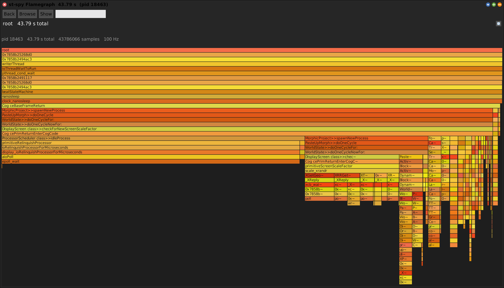

# SWAMessageTally -- Sampling (Statistical) Message Tally for Squeak


## Three flavours of message tally

"Message tally" is ambiguous, so keep the three flavours distinct:

| Flavour | What it measures | How | In this suite |
|---|---|---|---|
| **Full / deterministic** | *exact* call counts (every send) | instrumentation / wrappers | **partly** -- `SWATallyWrapper` (see [Deterministic call-tree capture](#deterministic-call-tree-capture-swatallywrapper) below); surfaced as a Code Map dataset, not yet its own tool |
| **Statistical, in-image** | approximate hot spots | Squeak's own `MessageTally` (`spyOn:`), sampling from *inside* the VM | -- (built into Squeak) |
| **Statistical, external** | approximate hot spots, wall time | the **st-spy** sampler ptraces the VM from *outside* | **`SWASamplingTally`** (this tool) |

This tool is the **external statistical (sampling)** flavour. `st-spy` is the
internal sampler binary it drives -- an implementation detail, not the tool's name.

## Motivation

Where the **[Code Map](SWACodeMap.md)** shows *static* structure and **test
coverage**, and **[SWASpaceTally](SWASpaceTally.md)** shows *memory*, the Sampling
Tally shows **where time actually goes at runtime**: a statistical sampling profiler
over a running Squeak image, presented as a call tree you can explore three ways
(flamegraph, treemap, explorer).

Because it is *external* (a separate process ptrace-samples the VM), it can profile
the very image you are working in without instrumenting a single method, and it
weights frames by real **wall-clock time** rather than raw sample counts.

## Quick start

```smalltalk
"Profile THIS image for 10 s (non-blocking) and auto-open the flamegraph."
SWASamplingTally recordSelfFor: 10.
SWASamplingTally open.                    "same thing; also the Apps-menu command"

"Profile another VM by pid, run your own block when the trace lands."
(SWASamplingTally onPid: 12345 duration: 10)
    record;
    whenReadyDo: [:spy | spy openTreemap].

"Explicit non-blocking open of the flamegraph."
(SWASamplingTally onPid: 12345 duration: 10) recordThenOpen.

"From an existing chrome-trace file, no recording."
(SWASamplingTally new parseTraceFile: '/tmp/opencode/trace.json') openFlamegraph.

"Synchronous (scripts / headless only -- BLOCKS the caller)."
| spy |
spy := SWASamplingTally onPid: 12345 duration: 10.
spy record; waitForTrace; openExplorer; openTreemap.
```

`recordSelfFor:atRate:` sets the sample rate (Hz); the default is 100. Each sample
briefly pauses the VM (~0.5 ms), so ~500 Hz means ~25 % pause time; the practical
ceiling is ~2000 Hz.



## The recording pipeline

`SWASamplingTally` is **non-blocking by design**: `record` launches the external
sampler detached and returns at once; nothing freezes the UI while sampling. The
result is picked up later via a poller.

```
record                      -> launch st-spy detached (sudo -n, backgrounded &),
                               stamp launchTime, force a fresh timestamped outputFile
   |  (st-spy samples for ~duration s, writing a chrome-trace JSON + a .log sidecar)
isReady                     -> true once the .log contains "Wrote chrome trace"
whenReadyDo: aBlock         -> fork a background poller:
   |                            waitWithProgress / waitQuietly until ready|failed|deadline
   +-- ready?  buildTree ; WorldState addDeferredUIMessage: [aBlock value: self]
   +-- else    WorldState addDeferredUIMessage: [inform: failureReason]
```

Key methods:

- **`record`** -- clears the previous tree/events, stamps `launchTime`, forces a
  fresh timestamped `outputFile`, runs the **preflight check**, and (if it passes)
  shells out to the sampler via `PipeableOSProcess command: recordCommand`. Returns
  immediately.
- **`recordCommand`** -- the backgrounded shell line:
  `sudo -n ./st-spy record -f chrometrace -d <dur> -r <rate> -o <out> --pid <pid> > <out>.log 2>&1 &`.
- **`recordThenOpen`** -- `record`, then `whenReadyDo: [:spy | spy openFlamegraph]`.
- **`whenReadyDo:`** -- forks a `userBackgroundPriority` poller that blocks *itself*
  (not the UI), builds the tree on success, and re-enters the UI process via
  `WorldState addDeferredUIMessage:` so view-opening is morphic-safe. Shows a
  `SystemProgressMorph` (bottom-of-World bar) unless `showProgress: false`.
- **`waitForTrace`** (synchronous, scripts only), **`waitQuietly`** (background, no
  UI), **`waitWithProgress`** (background + the progress bar) -- three wait
  strategies over the same `isReady | failed | deadline` loop.

### Preflight + failure diagnosis (about half the class)

External ptrace sampling has sharp, silent failure modes; most of the class is
about surfacing them clearly instead of a blank empty log.

- **`checkPreflight`** -- refuses to launch and sets `preflightError` when: no target
  pid; the target isn't running (`/proc/<pid>` missing); or a **stale tracer is
  already attached** (under `ptrace_scope` only one tracer may attach, so ours would
  fail its attach and write nothing). `tracerPid` reads `TracerPid:` from
  `/proc/<pid>/status` (shelled out, because procfs files report size 0 and can't be
  slurped by the VM).
- **`failed`** -- true on a preflight rejection, or an explicit error string in the
  `.log` (`error:`, `permission denied`, `a password is required`, `no such
  process`, ...). Critically, an **empty log is *not* a failure until the deadline**:
  `st-spy` runs under `sudo -n` and must acquire creds + ptrace-attach *before* it
  writes its banner, and that latency is variable -- treating an empty log as failure
  too eagerly produced false "wrote NOTHING" verdicts on slow-but-fine runs. So an
  empty log is failure only once `now > launchTime + (duration + 15) s`.
- **`failureReason`** -- distinguishes the modes for the warning dialog: preflight
  rejection / st-spy logged an error / st-spy wrote nothing (sudo NOPASSWD missing,
  wrong cwd, stale tracer) / timed out while still running.

### Configuration & environment coupling

- **`stSpyBinary`** = `'./st-spy'`, resolved against the VM's working directory
  (must be the repo root) and matched by a passwordless **`sudo` NOPASSWD** rule for
  that exact path, so `record` runs without a tty password prompt.
- **`outputFile`** defaults to `/tmp/opencode/stspy-<pid>-<unix>.json`, with a `.log`
  sidecar alongside; `isReady` polls the log for the `Wrote chrome trace` marker.
- This is an intentional, hard environment coupling (see [smells.md](smells.md) §5.4).

## The time model: from flamechart to a wall-time-weighted tree

`st-spy` emits a **chrome://tracing flamechart**: nested `B` (begin) / `E` (end)
events, each carrying a timestamp (`ts`, in microseconds), with consecutive
identical stacks coalesced into one long `B..E` span. So the meaningful weight of a
frame is not "how many samples" but **wall-clock time it was on the stack**.

`buildTreeFromEvents` folds the flat B/E stream into a merged call tree of
`SWASamplingTallyNode`, keeping three parallel stacks -- the live cursor path
(nodes), each frame's entry `ts`, and a per-frame accumulator of time already
attributed to its children:

```
on 'B':  child := cursor childNamed: name           "find-or-create"
         push (cursor, ts, childTime=0) ; cursor := child
on 'E':  span     := this.ts - entryTs
         selfTime := (span - childTime) max: 0
         cursor addSelfTime: selfTime               "credit only the exclusive time"
         parent's childTime += span                 "so the parent doesn't double-count"
         cursor := pop
```

After folding, `rollUpTotals` computes each node's `totalCount = selfCount + sum of
children`. **So `selfCount` / `totalCount` are microseconds, not sample counts** --
`totalCount` = wall time the frame (and its subtree) was on the stack, `selfCount` =
time it was the innermost (leaf) frame. `sampleCount` (the tally's overall figure)
is the root's `totalCount`. `formatMicros:` renders these as `us` / `ms` / `s`.

`parseTrace` reads the file with `STONJSON`; `parseTraceFile:` skips recording and
builds directly from an existing trace (useful for re-opening a captured run without
sudo).

### Frames: browsable Smalltalk vs native/VM

`SWASamplingTallyNode>>methodReference` parses a frame name back into
`{ theClass. selectorSymbol }`:

- `'Class>>selector'` -> `{ Class. #selector }`; `'Foo class>>bar'` handles the
  metaclass. Answers **nil** for native/VM frames (`epoll_wait`, `copyBits`,
  `0x7858...`, `poll`) -- those are not resolvable Smalltalk methods.
- `crossRefKey` -> `'Class>>selector'` for resolvable frames, nil otherwise (so a
  native frame never cross-references). `isSmalltalkFrame` / `compiledMethod` /
  `browse` gate on it.
- `sourceString` returns the method source for a resolvable frame, or -- for a
  native/missing frame -- a note *wrapped as a Smalltalk comment* so the Shout styler
  renders it cleanly instead of choking on non-Smalltalk.

## The three views

All three consume the *same* `SWASamplingTallyNode` tree and open through the shared
`SWAPane` chrome.

### Flamegraph (`SWASamplingTallyFlamegraphMorph`)

- One horizontal row per stack depth (root at top); each frame's **width** is
  proportional to its `totalCount` (wall time), packed left-to-right under its
  parent, so a frame is exactly as wide as the sum of its children.
- **Cached-Form blit:** the whole layout renders once into a Form (local coords) and
  is blitted each draw -- eliminating the per-frame repaint flicker.
- **Select-then-zoom:** click selects a frame (highlight + detail line + source);
  click the *same* frame again to zoom in (`focusNode:`), which packs its subtree to
  full width; ancestors collapse into a single **"zoom out" strip** at the top
  (click it, or **Back**, to unwind). The breadcrumb head-elides so the deepest
  frames stay visible.
- Colour is a classic warm flame palette hashed by frame name (stable per method);
  because it colours *intrinsically per frame*, the flamegraph is a good
  cross-reference **source** but not a colour **target**.
- Right-click explores the node; **Browse** opens the method; **Show** reveals the
  Shout-highlighted source pane.

### Treemap (`SWASamplingTallyTreemapMorph`)

A squarified treemap of the same tree, tiles sized by wall time. Colour is a heat
ramp by share of the root's total (cold blue -> hot red, `sqrt`-spread to open up the
low end where most frames live). Balloon/labels show time + percentage. Uses the
shared `SWASamplingTallyTreemapOverlay`.

### Explorer

A multi-column `ObjectExplorer` tree, hottest frames first, each line
`total%  duration  name  (self ...)`. Disclosure only where a frame has children.

## Projections: re-render the call tree as another structure

`SWASamplingTallyNode` can re-project the *same* call data into a different tree --
these feed the `SWAStructure` / **Tree** menu and the mask machinery:

- **`asCodeGroupingRoot`** -- discard caller/callee nesting and re-bucket every
  frame's `selfCount` per `'Class>>selector'`, then group by class: a fresh two-level
  `class -> method` tree weighted by total invocations. The inverse of a flamegraph
  (same data, *structural* grouping instead of dynamic nesting), rendered by the same
  treemap.
- **`prunedToKeys: aKeySet`** -- a copy of the tree keeping only frames whose
  `crossRefKey` survives (plus the ancestor frames on the path to a survivor, their
  own `selfCount` zeroed for context). A branch with no survivor is dropped. This is
  the call-tree analogue of a **mask** survivor set -- B's flamegraph pruned to
  `B \ A` (see the Code Map's Mask feature).

## Deterministic call-tree capture (`SWATallyWrapper`)

The other resident of this package is the **in-image, deterministic** counterpart
(the "full" tally row above), built on the `SWAMethodWrapper` substrate (see
[architecture.md](architecture.md) §7):

- `SWATallyWrapper` wraps a method to count **exact** invocations, self-evicting
  once a method gets too hot (`evictAt`) so the instrumented image keeps running.
- When armed via `SWATallyWrapper class>>beginCallTreeFor:`, each wrapped call folds
  its live stack of *watched* frames into a shared `SWASamplingTallyNode` tree
  (`recordStackFrom:leaf:`) -- weighting nodes by **invocation count** instead of
  microseconds, but using the identical tree structure the sampling flamegraph uses.
  `finishCallTree` rolls it up; `resetCallTree` disarms it (a plain counting tally
  then pays no per-call stack-walk cost).
- `SWACoverage>>captureCallTree: true` + `collectCallTree` is the front door: a **Call
  Tally** run in the Code Map instruments the shown packages, you exercise the
  system, press STOP, and the collected tree is offered as a flamegraph structure of
  a `#call` dataset. So the deterministic flamegraph exists today -- it just reaches
  you through the Code Map's Data menu rather than as a standalone opener parallel to
  the sampling tally (the gap tracked in [smells.md](smells.md) §6.2).

## Cross-referencing the profiler

Because the nodes speak `crossRefKey` (`'Class>>selector'`), a live profiler panel is
selectable as a **`#peer`** dataset from any other tool's **Data** menu -- e.g.
*"colour the Code Map by which methods the profiler sampled, and how hot"* -- and
container tiles roll up the weight of their sampled methods, so a class lights up
even though the peer is keyed at method granularity. The flamegraph is a good X-ref
*source* but (colouring intrinsically per frame) not a *target*. See the Data-menu
mechanism in [SWACodeMap.md](SWACodeMap.md#datasets-the-data-menu) and
[SWASpaceTally.md](SWASpaceTally.md#cross-referencing-the-views-via-the-data-menu).

## `SWAStructure` lives here (misfiled)

`SWAStructure` -- the generic *dataset tree-projection* class used by the **Tree**
button across all tools -- physically sits in `SWA-MessageTally` but is unrelated to
tallies. It carries `{ key. label. viewClass. rootBlock }` and lazily builds a view
on its (cached) tree. It belongs in `SWA-Base` ([smells.md](smells.md) §2.2).

## See Also

- **[SWACodeMap](SWACodeMap.md)** -- static structure, byte composition, coverage,
  duplication, topics; and the Data menu that hosts a profiler as a `#peer` dataset.
- **[SWASpaceTally](SWASpaceTally.md)** -- structural memory analysis.
- **[architecture.md](architecture.md)** / **[api.md](api.md)** / **[smells.md](smells.md)**
  -- the engineering layer.
- **[index](index.md)** -- the shared SWA tools index.
