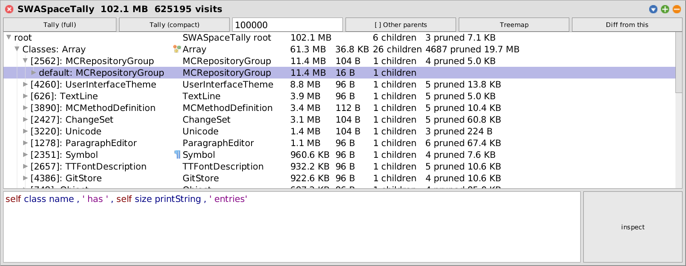
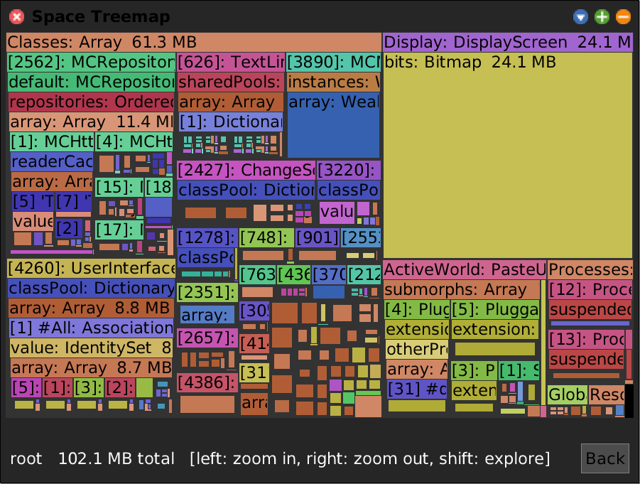
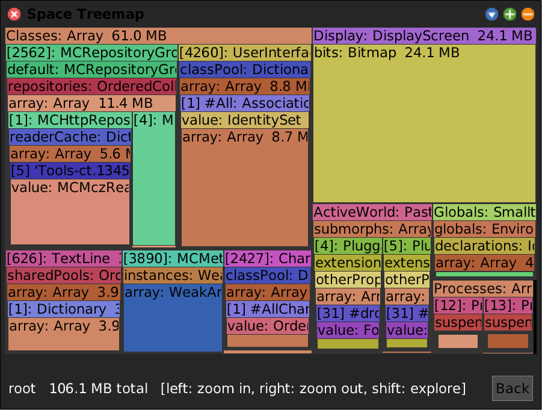
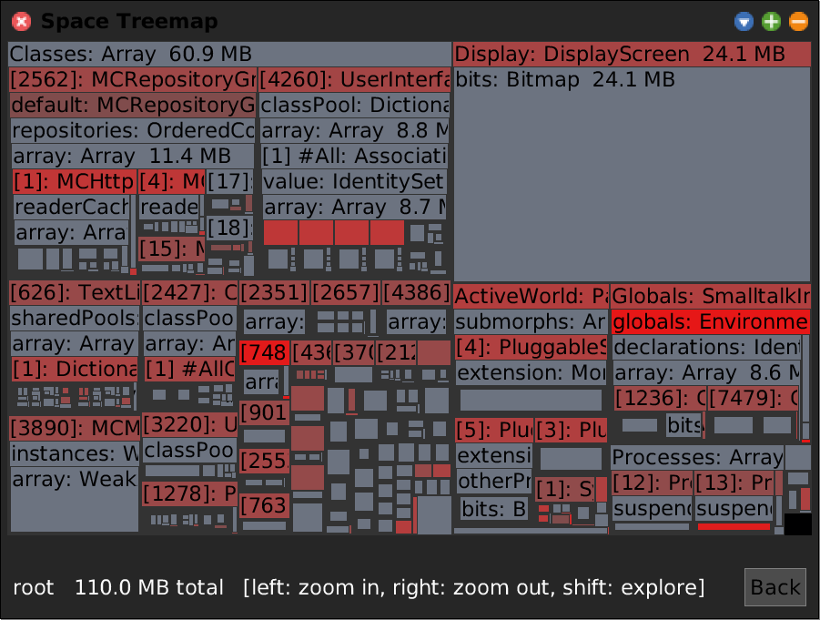
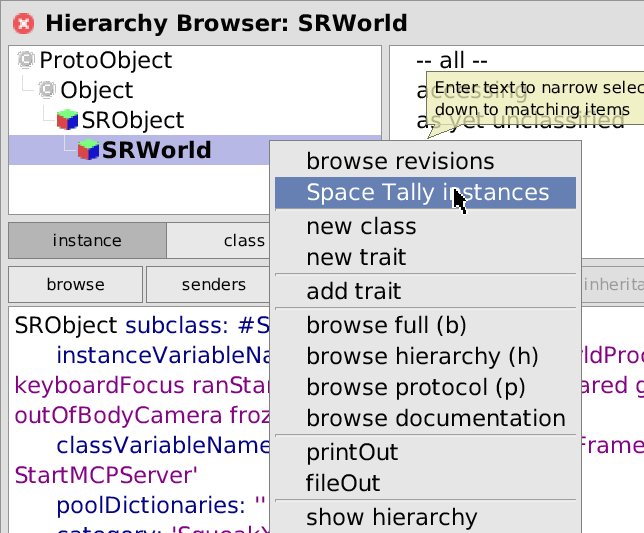
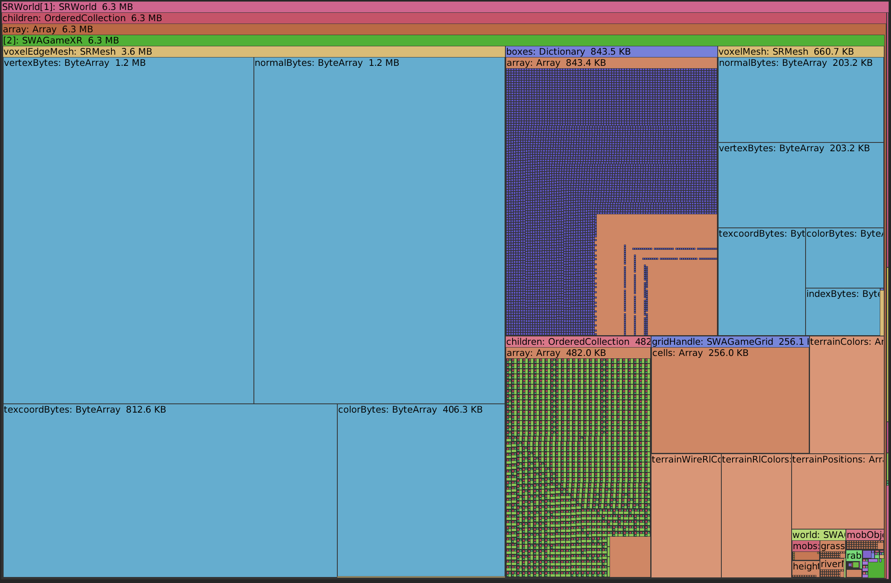
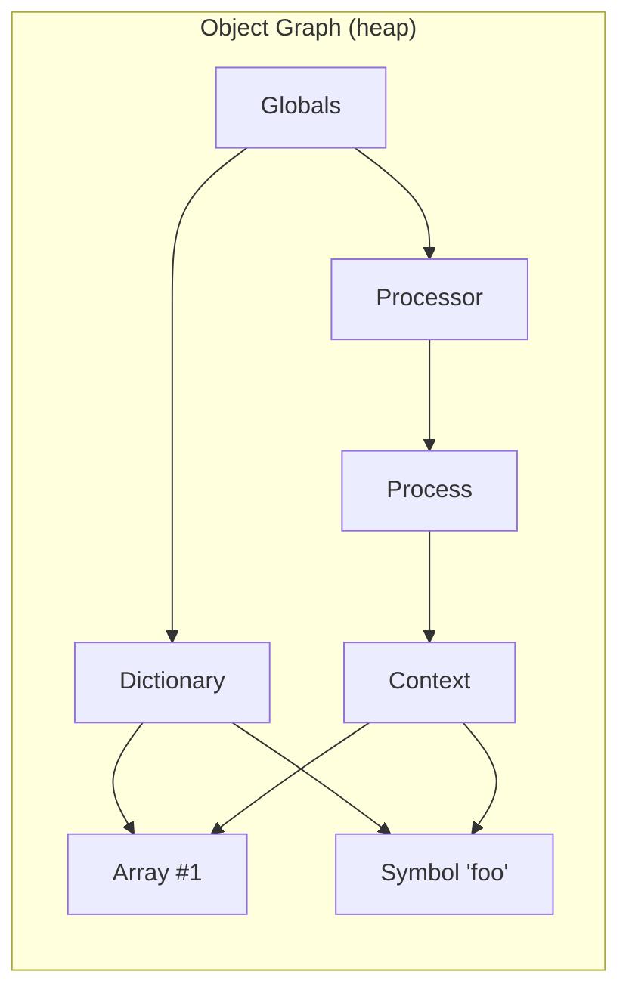
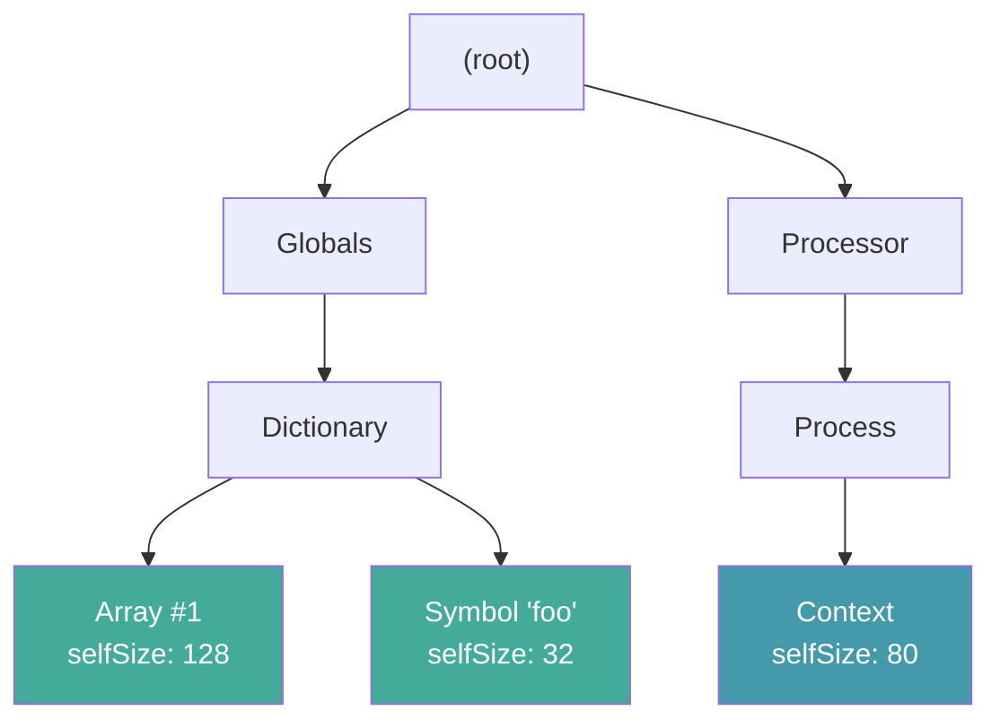

# SWASpaceTally -- Structural Memory Analysis for Squeak

> **Doc-drift note (as of the architecture pass):** the *Performance* section below
> and any mention of `deadlineMs` / `#timeout` describe the pre-rewrite walker. The
> current walker uses the **closed-universe** guarantee (snapshot the heap up front),
> so there is no wall-clock deadline -- only an optional, testing-only `maxVisits`
> (see the *Termination* section, which is current). For the engineering view see
> [architecture.md](architecture.md) §8 and [smells.md](smells.md) §6.7.

## Motivation

Squeak's built-in `SpaceTally` answers a simple question: How much memory does each class use? It iterates over every object in the heap, groups them by class, and sums up instance sizes. The result is a flat table:

```
OrderedCollection   4,217 instances   1.2 MB
Array              12,843 instances   8.7 MB
ByteString         31,002 instances   2.1 MB
...
```

This is useful for a first overview, but it cannot tell you why those objects exist, who holds them, or how they compose into larger structures. An `Array` with 8.7 MB could be one giant lookup table or
thousands of tiny arrays spread across the entire system. You cannot distinguish the two.

**SWASpaceTally** takes a different approach. Instead of iterating over all objects, it walks the live object graph starting from known roots (globals, classes, processes, the display). It builds a tree where every node knows:

- its own byte size (`selfSize`)
- the rolled-up size of everything reachable below it (`totalSize`)
- the slot or variable name through which its parent references it (`edgeLabel`)
- the path back to the root  (`parent`)
- and optionally all other objects that reference it (`otherParents`)

This gives you structural insight, e.g. you can see that a 4 MB `OrderedCollection` inside a `FontCache` holds 200 `StrikeFont` instances averaging 20 KB each, and that the fonts' `CharacterMap` arrays account
for most of that. You can trace any object back to the root that keeps it alive.


## Explorer

The Squeak Object Space Tally presents the resulting tree in a multi-column tree browser. 





## Treemap

A squarified treemap where area = byte size, with zoom-in/out navigation and hover tooltips



The compacted tree shows he same heap pruned to a higher byte threshold. Fewer, larger tiles give a
coarse overview where the labels are readable.



### Color Modes

With `trackOtherParents: true` and the "By shared references" color mode, tiles are tinted red in proportion to how many *other* parents reference the same object. Unique objects are blue-gray; heavily-shared objects (symbols, interned strings, the `Environment`) glow red. This reveals which objects are structurally shared across the system versus owned by a single parent.




### Diff

It compares two tallies and see only the new objects, revealing exactly what your application allocated


### Space Tally Instances

One can also directly start the space tally on a collections of instances. In this mode known global roots like Class objects are cut off, to better show the object group in isolation.






## Shared View Architecture

SWASpaceTally is one of three sibling tools that all visualise a tree of nodes as
a navigable treemap (or flamegraph): the **Space Tally** (memory), the **Sampling
Tally** (a statistical message-tally profiler, driven by the external st-spy
sampler), and the **Code Map** (the static package/class/method structure). Rather
than duplicate the tree, layout, and navigation code three times, they share two
small abstractions.

### `SWANode` -- the common tree contract

All three data models subclass `SWANode`, which owns the `parent`/`children`
structure and the shared tree protocol (`depth`, `pathString`, `isLeaf`,
`withAllChildrenDo:`). Subclasses fill in three things:

| Subclass | `name` | `totalSize` (treemap weight) | `crossRefKey` |
|---|---|---|---|
| `SWASpaceTallyNode` | class / slot label | bytes | class name (class-granular) |
| `SWASamplingTallyNode` | frame name | wall time (us) | `'Class>>selector'` or nil |
| `SWACodeNode` (and `SWACodeClassNode`/`SWACodeMethodNode`) | class / selector | lines of code | class name, or `'Class>>selector'` |

### `SWAView` -- the common morph

Both the treemap (`SWATreemapMorph`) and the Sampling Tally flamegraph
(`SWASamplingTallyFlamegraphMorph`) subclass `SWAView`, a `Morph` that holds the shared
state (`rootNode`, selection, render cache, the chrome link to the nav panel) and
the cross-reference machinery. Subclasses only supply layout-specific state and a
`baseColorForNode:` palette.

### `SWAPane` -- the chrome

A `SWAPane` wraps any `SWAView` and adds the header chrome shared by all three
tools: **Back / Browse / Show** (source), **Data** (pick a data source, including
open peers), **Tree** (pick the base structure), **Size / Color / Links** where the
view supports them, an optional **Depth** cutoff, a breadcrumb, and a fullscreen
toggle.

The whole-image code map has its own Apps-menu entry:

> **open... -> Code Map**

```smalltalk
SWAPane openOnPackageNamed: '*' leafKind: #class.
```


## Cross-Referencing the Views (via the Data menu)

Because all three tools speak the same `crossRefKey` vocabulary -- class names are
unique, methods are `'Class>>selector'` -- an open panel can be coloured by another
open panel's data. This is no longer a dedicated **X-ref** button; it is an entry in
the **Data** menu, so cross-referencing a live peer works exactly like loading a
dataset from a file. It answers questions that span two views, e.g.:

- *"Colour the static Code Map by how much memory each class measured in the
  Space Tally."*
- *"Highlight in the Code Map exactly which methods the Sampling Tally profiler
  sampled, and how hot they were."*

### How it works

1. Each `SWAView` builds a `keyIndex` (a `crossRefKey -> node` dictionary) eagerly
   in `setRoot:`, so peers can look its nodes up in O(1).
2. The **Data** menu lists every other open panel (`SWAPane openPanels`) as an
   "X-ref: `<window>`" entry. Picking one wraps it as a `#peer` `SWADataset` whose
   source (`SWAPeerViewSource`) reads the peer's live `keyIndex`, weighting each key
   by that node's `totalSize` (bytes / samples / loc).
3. It becomes the active dataset like any loaded file: its *By shared weight* metric
   drives colour on a log-normalized ramp. Picking another source -- or **None** --
   replaces or clears it. Loading it once retains it, so you can switch back.
4. Container tiles **roll up**: `SWADatasetMetric>>valueForNode:` aggregates a
   node's descendants when its own key has no value, so a *class* or *package* tile
   is coloured by the summed weight of its matching methods -- a class lights up even
   though the peer is keyed at method granularity.

The mechanism is symmetric (either view can be source or target) and uniform: a peer
is just one more `SWADataset`, mixing and matching with coverage, duplication, and
space-tally data.


## Quick Start

From the world menu: open... -> Space Tally

Or just:

```smalltalk
SWASpaceTally explore.           
SWASpaceTally walk openTreemap.  
```

## Saving a Tally to JSON

A walked (and optionally compacted) tally can be streamed to a JSON file so the
dataset can be archived, diffed offline, or re-opened later without re-walking.

```smalltalk
"Class-side convenience: walk default roots, compact at 1 KB, write."
SWASpaceTally generateToFile: 'tally.json'.

"Tune or disable the compact step (positive = prune under N bytes,
 0 = compact marker only, nil = raw walked tree):"
SWASpaceTally generateToFile: 'tally.json' compact: 4096.

"Instance-side, when you already have a tally in hand:"
(SWASpaceTally walk compact: 1024) writeToFile: 'tally.json'.
```

Serialization is a **single streaming pass** (`SWASpaceTallyJsonWriter`): no giant
second copy of a possibly ~1M-node tree, and it writes straight to the file
stream. Each node emits a stable integer **`id`** (minted on first sight via an
`IdentityDictionary`), plus `className` (for cross-referencing) and its
**`otherParents` as a list of ids**. Because the other-parent refs resolve through
the *same* id map as the tree walk, the shared-reference graph -- what powers the
"By shared references" color mode and the other-parent relation lines -- survives
the tree->JSON flattening. String escaping is delegated to the image's `Json`.

The compact step is enabled by default (1 KB byte cutoff) but tunable: it only
prunes a node's tiny *children* (rolling them into `prunedChildCount` /
`prunedChildBytes`); it never touches a surviving node's own `otherParents`, so no
shared-ref information is lost for the nodes that remain.

## Loading a Tally from JSON

`SWASpaceTallyJsonReader` is the inverse of the writer: it rebuilds a live
`SWASpaceTallyNode` tree from the file, resolving the `id` / `otherParents`
references back into node links.

```smalltalk
"Load into a SWASpaceTally and open it (static -- no live objects, only the
 serialized structure + sizes):"
(SWASpaceTally loadFromFile: 'tally.json') openTreemap.

"Or just the node tree:"
SWASpaceTallyJsonReader readFrom: 'tally.json'.
SWASpaceTallyJsonReader readFromString: aJsonString.
```

Reconstruction is a single recursive descent with the same **mint-on-first-sight**
id map as the writer (`nodeForId:` mirrors `idFor:`), so an `otherParents` id
referenced *before* its own tree node is visited still resolves to the same live
node. `otherParents` are wired in a **second pass** once every id is known.
`restoreFromJson:` sets each node's flat fields; since a loaded node has no live
`obj`, the serialized display name is kept in `restoredName` (honored first by
`#name`).

One fidelity note: an `otherParents` id can point at a node that was **pruned by
compaction** (its own tree node was never emitted). The reader tracks which ids
were actually emitted (`realIds`) and **drops** such dangling refs rather than
resolving them to an empty stub -- so every reconstructed other-parent is a real
node present in the tree.

**Binding a loaded dataset.** Once loaded, the same tally dataset can be bound
three ways: (a) its own Space Tally panel (`loadFromFile:` + `openTreemap`, done),
(b) a *decorate* metric on the Code Map -- tint each class by its measured bytes,
via the existing `crossRefKey` (class name), no tree swap -- **done, see below**
-- or (c) the *structure* of the Code Map, replacing its root so the code map
morphs into a space tally in place. The role is the **binding**, not the dataset
kind: "decorate" (color/size/link an existing tree) and "structure" (`setRoot:`
the dataset's own tree) are orthogonal axes any dataset can use.

## Decorating the Code Map with per-class bytes

A space tally can color the Code Map's classes -- and, by `#sum` rollup, its
packages -- by how much memory they measured. Two flavors, both funnelled through
one `#spaceTally` `SWADataset` and the same `crossRefKey` (class name) the Code
Map already uses.

**The easiest way is the Code Map's own `Load` button.** It opens a `*.json`
chooser and dispatches by content: a space-tally JSON (a node tree, or a flat
`kind: classSummary` census) is recognized (it has no coverage/duplication
`format` marker) and bound as a `#spaceTally` dataset automatically -- exactly like
loading a coverage or duplication file. So the workflow is just: generate the JSON,
then `Load` it.

```smalltalk
"Generate the file(s) to Load:"
"1) Object-space view (per-class self + total/retained bytes from the walk):"
SWASpaceTally generateToFile: 'tally.json'.
"2) System-wide view (pure per-class instance usage, image-wide, ONE heap pass):"
SWASpaceTallyClassSummary systemWide writeToFile: 'system-tally.json'.
```

Programmatically (what the Load button does under the hood):

```smalltalk
| ds map |
ds := SWADataset spaceTallyFromJsonFile: 'tally.json'.       "or system-tally.json"
map addDataset: ds; selectDataset: ds.
```

`SWASpaceTallyClassSummary` is the intermediate structure both flavors produce: a
`className -> { self. total. count }` map, keyed exactly like a Code Map class
node.

- **From a tree** (`fromTree:` / `fromJsonFile:`): fold every `SWASpaceTallyNode`
  into per-class buckets. `self` = summed `selfSize` (bytes the instances occupy
  themselves), `total` = summed `totalSize` (contents included). This is the
  reachability view -- what the tally walked from its roots.
- **System-wide** (`systemWide`): one `SystemNavigation allObjectsOrNil` sweep,
  bucketing every live object by class -- O(heap), **not** per-class
  `allInstancesDo:` (which is O(classes x heap) and takes minutes). `self` ==
  `total` here (a flat census has no retained dimension). This is the pure
  per-class usage view.

The `#spaceTally` dataset exposes two metrics -- **By instance bytes** (`self`) and
**By retained bytes** (`total`) -- each on the color and size axes. Default binding
is color = instance bytes, **size left intrinsic (LOC)** (same rationale as
coverage: sizing by the metric collapses unmeasured code to zero width). The color
ramp is **log-normalized** against the dataset's own max (byte totals span orders
of magnitude): blue (small) -> green -> yellow -> red (largest). A class the tally
never measured yields `nil` and keeps its neutral base tint.

The system-wide census is written as a compact **flat** JSON
(`{"kind":"classSummary","classes":[{"name","self","total","count"},...]}`);
`SWASpaceTallyClassSummary fromAnyJsonFile:` dispatches on the top-level `kind` so
`spaceTallyFromJsonFile:` transparently accepts either a flat census or a full
node tree.

## The Tree button: morph one tool into another

Decorate (color/size) reuses the Code Map's tree. The **Tree** button in the
`SWAPane` header goes further: it picks which node tree IS the base structure,
so the whole view **morphs from the Code Map into the loaded Space Tally in
place** -- same window, same chrome -- and back. This is the "structure" binding:
a fourth axis alongside color/size/links that swaps the root itself.

Only a space tally loaded from a **node-tree** JSON can be a structure: that
dataset retains its reconstructed `SWASpaceTallyNode` tree (`structureRoot`) in
addition to the per-class decorate summary -- the serialized tree carries *both*.
A flat class-summary census has no tree, so it stays decorate-only and does not
appear in the Tree menu.

How the morph works (`SWAPane`):

- The Tree menu lists **Code map** (`#intrinsic`) plus one **Space tally: <name>**
  per structure-capable dataset (`structureOptions`).
- Picking one calls `setStructureMode:`, which builds -- **once, then cached** --
  a `SWASpaceTallyTreemapMorph` on the dataset's `structureRoot`, wires its
  overlay (`overlayClass` is a per-view hook), and swaps it into the panel via
  `morphViewInto:` (detach old view, rebuild the header/chrome, keep the window).
- Both views are kept alive in `structureViews`, so switching is **instant and
  lossless**: the Code Map keeps its loaded datasets (you can morph back and still
  have the decorate metrics), and the tally keeps its layout. The window title
  tracks the active structure.

So the same loaded tally is usable three ways from one Load: decorate the Code Map
by bytes (color/size), or BE the map (Tree), and switch freely between them.

## The Diff Tool

The object space tally diffing allows to see space usage and structure applications:

1. Take a **baseline** tally of the entire heap
2. Do something (open a window, load data, run a simulation)
3. Take a **second** tally
4. Show only the objects that are new

This filters out the entire Squeak system, the base libraries, the
compiler, the UI framework. What remains are the objects your application created.

```smalltalk
"Step 1: baseline"
base := SWASpaceTally walk compact.

"Step 2: do something"
MyApp open.

"Step 3: diff"
after := SWASpaceTally walk compact.
diff := after diffFrom: base.
diff openExplorer.

"Or as a one-liner (uses the Diff button in the explorer):"
"Click 'Diff from this' in any explorer window"
```

### How the Diff Works

The diff compares object identity and shows their actual structure, and not their API. An `OrderedCollection` that grew (replacing its internal array with a bigger one) will show the new array
as a new allocation -- because it is one.

The algorithm:

1. Collect all live objects from the baseline into an `IdentitySet`
2. Walk the second tally's tree recursively
3. A node is new if its object is not in the baseline set
4. Keep a branch only if it contains at least one new node
5. Nodes on the path to new objects are kept for context, but their
   `selfSize` is zeroed (they don't inflate totals)
6. Roll up `totalSize` on the filtered tree

The result is a proper `SWASpaceTally` tree with all the same features
(explorer, treemap, further diffs).

## Implementation: From Object Graph to Tree

### The Problem: Graphs Are Not Trees

The Smalltalk heap is a directed graph with cycles and shared
references. A `Symbol` might be referenced by 500 different methods.
A `Color` instance might be shared by thousands of morphs. You cannot
display a graph directly as a tree without making choices.

### The Solution: BFS First-Reached-Parent

SWASpaceTally uses breadth-first search from the roots. The first path
to reach an object claims it. All other paths are ignored (or optionally
tracked as `otherParents`). This turns the graph into a tree:



BFS visits `Globals` first, then `Dictionary` and `Processor`, then
`Array #1`, `Symbol 'foo'`, and `Process`. When `Context` is reached,
it tries to enqueue `Array #1` and `Symbol 'foo'` but they are already
in the `seen` set -- so `Context` does not get credit for them:



The tree is now a proper hierarchy where `totalSize` at any node equals
`selfSize + sum of children's totalSize`. No double-counting.

### BFS Walk Step by Step

```mermaid
flowchart TD
    START([Start]) --> UNIV["Snapshot closed universe:<br/>GC, then deepUniverse =<br/>all live objects (allObjectsOrNil)"]
    UNIV --> INIT["Initialize:<br/>seen = {self, queue, roots, ...}<br/>queue = empty<br/>visitCount = 0"]
    INIT --> ROOTS["Enqueue root objects<br/>(Display, ActiveWorld, ..., Classes)"]
    ROOTS --> CHECK{queue not empty<br/>AND visitCount < maxVisits?<br/>(maxVisits nil = unlimited)}
    CHECK -- No --> TRUNC["Mark remaining queue<br/>nodes as truncated"]
    TRUNC --> ROLLUP["Post-order rollUp:<br/>totalSize = selfSize +<br/>sum children totalSize"]
    ROLLUP --> DONE([Return tree])
    CHECK -- Yes --> DEQUEUE["node = queue removeFirst<br/>visitCount += 1"]
    DEQUEUE --> ENUM["Enumerate referents of node.object:<br/>- named instVars (by name)<br/>- indexed slots ([N], strong only)<br/>- compiled code literals<br/>- class pointer (Behaviors only)"]
    ENUM --> EACH{"For each referent"}
    EACH -- "Not in universe,<br/>already seen,<br/>or immediate/nil" --> SKIP[Skip] --> EACH
    EACH -- "New object" --> CREATE["Create child node<br/>Record edge label<br/>Add to seen<br/>Add to queue"]
    CREATE --> EACH
    EACH -- "Done" --> CHECK
```

There is no depth or wall-clock cutoff: the closed `deepUniverse` snapshot plus
the `seen` set (each object claimed once) make the BFS finite on its own.
`maxVisits` is optional and only used to deliberately bound a run for testing.

### Slot Enumeration

The BFS needs to find all objects referenced by a given object. This is
done by `referentsOf:do:`, which handles three cases:

| Object kind | How slots are read |
|---|---|
| Named instVars | `thisContext object:instVarAt:` for indices 1..instSize |
| Indexed pointer slots | `thisContext object:basicAt:` for indices 1..basicSize |
| CompiledCode literals | `literalsDo:` (includes the class binding) |

All slot access goes through `thisContext` mirror primitives, bypassing
any `instVarAt:` overrides on proxies, futures, or contexts. This is
the same technique the system's own `SpaceTally` uses.

Two special cases:

- **Weak slots are not followed.** For a weak class the indexed (variable) part
  holds weak references, which do not express ownership; following them would
  impose a misleading parent. Only the strong named instVars of a weak object
  are walked. Anything reachable solely through a weak slot is claimed later via
  a strong path, or lands in *LostAndFound* (see below).
- **The class pointer is followed for classes/metaclasses.** A class's class
  header field is not an instVar/index/literal slot, so it would otherwise never
  be traversed and every metaclass (plus the class-instance-var state it holds:
  singletons, caches, registries) would be unreachable. For `Behavior`s only we
  add a `<class>` edge: `Foo -> Foo class -> Metaclass`.

### Edge Labels

Each child node records how it was reached from its parent:

- `'array'`, `'globals'`, `'x'` -- named instance variable
- `'[14]'` -- indexed slot at position 14
- `'#literals[3]'` -- compiled method literal at index 3


## Termination: the Closed Universe

Every walk begins by snapshotting a **closed universe**: a garbage collection
followed by `SystemNavigation default allObjectsOrNil` (primitive 178), stored in
the `deepUniverse` identity dictionary *before any walker state is allocated*.
The BFS then only ever follows objects that are members of this universe, and the
`seen` set claims each object exactly once. Because the universe is finite and
fixed up front, the walk is guaranteed to terminate without any depth cap, visit
cap, or wall-clock deadline.

Two consequences:

- The walker's own scaffolding (nodes, collections, dictionaries) is created
  *after* the snapshot, so it is never in the universe and can never be mistaken
  for a real object or re-tallied.
- If the heap can't be snapshotted (low memory -> `allObjectsOrNil` returns nil),
  the walk aborts with an error rather than running without the guarantee.

`maxVisits` is **optional** (nil = unlimited, the normal case). Set it to a
positive integer only to deliberately bound a run -- a quick partial walk or a
test. A bounded walk that stops early records `limitHit := #maxVisits`, marks the
unvisited queue nodes as truncated, and (in Find Deep mode) skips the sweep,
since reachability is then unknown.


## Find Deep: the LostAndFound Sweep

After a *complete* walk, **Find Deep** mode sweeps the whole universe for objects
no root ever reached and buckets them under a synthetic `LostAndFound` node --
making orphan cycles, retained-only graphs, and VM-internal scaffolding visible.

An object is "lost" iff it is in `deepUniverse` and **not** in `seen`. The sweep
is O(N) over the universe (no reverse pointer-finding). To keep the UI usable,
the flat list of lost objects is grouped into one bin per class
(`ClassName (count)`, sorted by count). The sweep only runs when the walk
completed; an incomplete walk can't distinguish "unreachable" from "not yet
visited", so it is skipped and the title shows a loud `WARNING`.

```smalltalk
SWASpaceTally walkDeep openExplorer.   "default roots + sweep"
SWASpaceTally exploreDeep.             "walkDeep + explorer"
```


## Charging Rule

When an object is reachable from multiple paths, the **first parent BFS
reached** claims it. Other paths get no credit. This means:

- `SymbolTable` looks tiny because `Classes` enqueues most symbols first
- Shared objects (Colors, nil-substitute markers) attach to whichever
  root group happened to reach them first

This is intentional, since it's cheap, deterministic, and good enough for
interactive exploration. For a different attribution, walk with a single
root group at a time.

## Performance

On the development image (ARM64 Cog JIT, ~2.3M live objects, 222 MB heap):

- ~45,000 visits/second
- Full walk (~1.17M reachable objects): ~7 seconds
- Diff computation: ~2 seconds additional (dominated by `allObjects` set building)

The walk is allocation-heavy: one `SWASpaceTallyNode` per visited object (its
children collection is allocated lazily). The `seen` IdentityDictionary is
pre-sized to the exact universe size -- reached objects are a subset of the
universe, so there is no mid-walk rehashing (uncontrolled rehashing once crashed
the VM at ~6M entries).


## Walking an Image File: the Simulator Walker

`SWASimSpaceTally` walks the heap of a Squeak **image file on disk** rather than
the running image, by loading it into a `StackInterpreterSimulator` (from
VMMaker) and traversing the simulated object memory. This lets you analyze an
image without booting it -- useful for crashed, headless, or foreign images.

```smalltalk
"From a file chooser (Apps menu: 'Space Tally (image file)'):"
SWASimSpaceTally chooseImageAndExplore.

"Or directly:"
(SWASimSpaceTally onImage: 'some.image') findDeep: true; walk; openExplorer.
```

It is a subclass of `SWASpaceTally` and shares the same `walk` template method;
only the object-access primitives differ. Where the live walker uses
`thisContext` mirror primitives and dedups on object identity, the sim walker
goes through a `SimObjectMirror` over the simulated memory manager and dedups on
**oop** (the simulated object's address). The subclass customizes the walk only
through the template hooks (`captureUniverse`, `newSeenOfSize:`, `makeRootNode`,
`seedRoots`, `expandNode:`, `findLostObjects`, ...).

A few sim-specific details:

- **Roots are resolved inside the simulated image** (host globals don't translate
  to sim oops): `Display`, `ActiveWorld`, every `Process`, `Processor`, the
  simulated `Smalltalk`, the class table (`classTableRootObj`, a hidden root that
  holds every class -- not reachable from `specialObjectsArray`), and the special
  objects array.
- **Byte sizes are header-inclusive** (`bytesInBody:`), matching the simulator's
  own accounting.
- **VM-internal objects are labelled by role.** The memory manager's own
  scaffolding (free lists, remembered set, class-table pages, index/bitmap word
  arrays) has no real Smalltalk class -- the VM reports `bad class`. These are
  relabelled `<VM: freeLists>`, `<VM: classTablePage>`, etc., so nothing shows up
  as "bad class".

### How the External-Image Approach Works

The live walker can only ever see the heap it is running in. To analyze a
*different* image -- one on disk, possibly crashed, headless, or from another VM
generation -- we need a way to read that image's objects without executing it.
`SWASimSpaceTally` does this by reusing the VM's own object memory code as a
library:

1. **Load, don't run.** `openSimulatorOn:` creates a `StackInterpreterSimulator`
   (the bytecode interpreter VMMaker uses for development), configures it for a
   64-bit Spur heap with multiple bytecode sets, and calls `openOn:extraMemory:`.
   This deserializes the image file into the simulator's object memory but never
   starts the interpreter -- we only want a quiescent heap to traverse.

2. **Mirror, don't message.** The objects in that heap are not real Smalltalk
   objects in our image; they are addresses (*oops*) into the simulator's memory.
   We can't send them messages. Instead, every node wraps a `SimObjectMirror`,
   which answers questions about an oop by calling the simulator's memory manager
   directly: `fetchClassOf:`, `numSlotsOf:`, `bytesInBody:`, `fetchPointer:ofObject:`,
   `nameOfClass:`, and so on. The mirror is the sim analogue of the live walker's
   `thisContext` slot-access primitives.

3. **Dedup on oop, not identity.** A simulated object is identified by its oop
   (an `Integer` address), so the dedup map is a plain value-keyed `Dictionary`
   rather than an `IdentityDictionary`. Forwarders (Spur's lazy-become pointers)
   are resolved with `followOop:` so a moved object is only counted once.

4. **Same algorithm, same tree.** Apart from those access details, everything is
   shared with the live walker via the `walk` template method: the closed-universe
   snapshot (`allObjectsDo:` over the simulated memory), the BFS, weak-slot
   skipping, the class-pointer edge, the LostAndFound sweep, and the resulting
   explorer/treemap/diff tooling all work identically.

**Tradeoffs.** The approach needs VMMaker loaded (the dependency is resolved
lazily, so the package loads fine without it -- it only bites when you actually
open an image). Traversal is slower than the live walk because every slot access
is an interpreted memory-manager call rather than a primitive. In exchange you
get total isolation: you can inspect an image that won't boot, and the analyzed
heap is completely separate from the heap you are analyzing it in -- the walker's
own allocations can never perturb the numbers.


## Interesting Findings

- Each Morphic window in Squeak holds a rather large bitmap to display its drop shadow.

