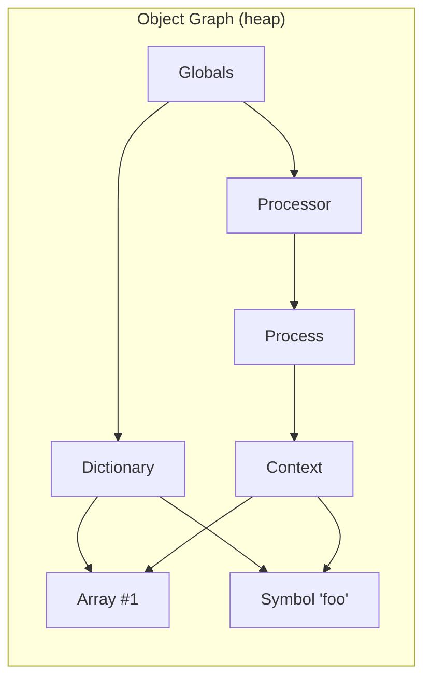
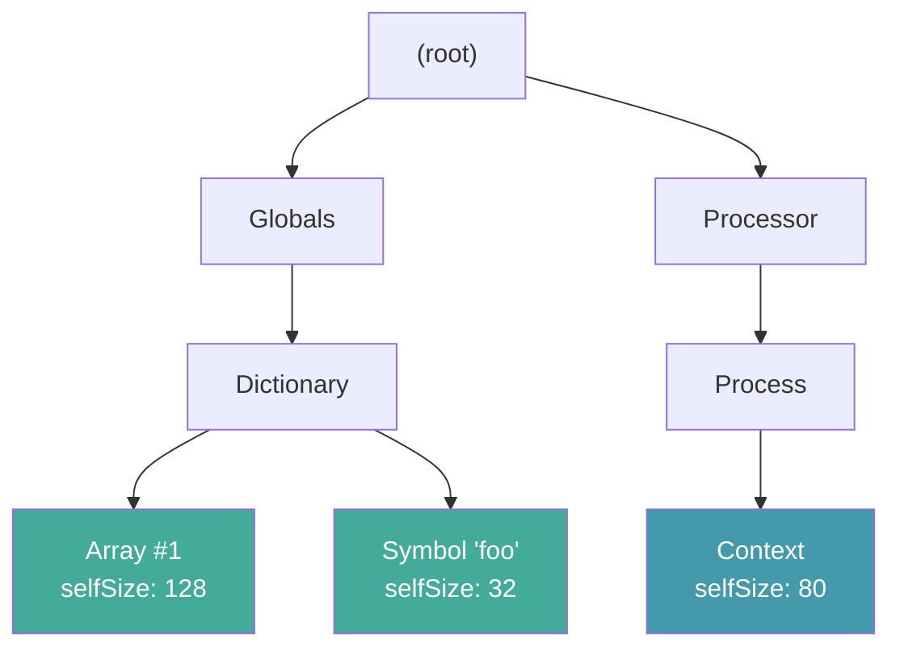
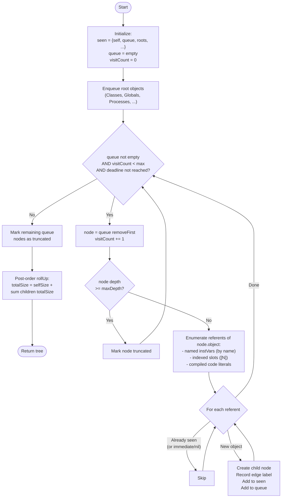

# SWASpaceTally -- Structural Memory Analysis for Squeak

## Motivation

Squeak's built-in `SpaceTally` answers a simple question: How much memory does each class use? It iterates over every object in the heap, groups them by class, and sums up instance sizes. The result is a flat table:

```
OrderedCollection   4,217 instances   1.2 MB
Array              12,843 instances   8.7 MB
ByteString         31,002 instances   2.1 MB
...
```

This is useful for a first overview, but it cannot tell you why those objects exist, who holds them, or how they compose into larger structures. An `Array` with 8.7 MB could be one giant lookup table or
thousands of tiny arrays spread across the entire system. You cannot distinguish the two.

**SWASpaceTally** takes a different approach. Instead of iterating over all objects, it walks the live object graph starting from known roots (globals, classes, processes, the display). It builds a tree where every node knows:

- its own byte size (`selfSize`)
- the rolled-up size of everything reachable below it (`totalSize`)
- the slot or variable name through which its parent references it (`edgeLabel`)
- the path back to the root  (`parent`)
- and optionally all other objects that reference it (`otherParents`)

This gives you structural insight, e.g. you can see that a 4 MB `OrderedCollection` inside a `FontCache` holds 200 `StrikeFont` instances averaging 20 KB each, and that the fonts' `CharacterMap` arrays account
for most of that. You can trace any object back to the root that keeps it alive.


## Explorer

The Squeak Object Space Tally presents the resulting tree in a multi-column tree browser. 


## Treemap

A squarified treemap where area = byte size, with zoom-in/out navigation and hover tooltips


The compacted tree shows he same heap pruned to a higher byte threshold. Fewer, larger tiles give a
coarse overview where the labels are readable.


### Color Modes

With `trackOtherParents: true` and the "By shared references" color mode, tiles are tinted red in proportion to how many *other* parents reference the same object. Unique objects are blue-gray; heavily-shared objects (symbols, interned strings, the `Environment`) glow red. This reveals which objects are structurally shared across the system versus owned by a single parent.


### Diff

It compares two tallies and see only the new objects, revealing exactly what your application allocated


### Space Tally Instances

One can also directly start the space tally on a collections of instances. In this mode known global roots like Class objects are cut off, to better show the object group in isolation.


## Quick Start

From the world menu: open... -> Space Tally

Or just:

```smalltalk
SWASpaceTally explore.           
SWASpaceTally walk openTreemap.  
```

## The Diff Tool

The object space tally diffing allows to see space usage and structure applications:

1. Take a **baseline** tally of the entire heap
2. Do something (open a window, load data, run a simulation)
3. Take a **second** tally
4. Show only the objects that are new

This filters out the entire Squeak system, the base libraries, the
compiler, the UI framework. What remains are the objects your application created.

```smalltalk
"Step 1: baseline"
base := SWASpaceTally walk compact.

"Step 2: do something"
MyApp open.

"Step 3: diff"
after := SWASpaceTally walk compact.
diff := after diffFrom: base.
diff openExplorer.

"Or as a one-liner (uses the Diff button in the explorer):"
"Click 'Diff from this' in any explorer window"
```

### How the Diff Works

The diff compares object identity and shows their actual structure, and not their API. An `OrderedCollection` that grew (replacing its internal array with a bigger one) will show the new array
as a new allocation -- because it is one.

The algorithm:

1. Collect all live objects from the baseline into an `IdentitySet`
2. Walk the second tally's tree recursively
3. A node is new if its object is not in the baseline set
4. Keep a branch only if it contains at least one new node
5. Nodes on the path to new objects are kept for context, but their
   `selfSize` is zeroed (they don't inflate totals)
6. Roll up `totalSize` on the filtered tree

The result is a proper `SWASpaceTally` tree with all the same features
(explorer, treemap, further diffs).

## Implementation: From Object Graph to Tree

### The Problem: Graphs Are Not Trees

The Smalltalk heap is a directed graph with cycles and shared
references. A `Symbol` might be referenced by 500 different methods.
A `Color` instance might be shared by thousands of morphs. You cannot
display a graph directly as a tree without making choices.

### The Solution: BFS First-Reached-Parent

SWASpaceTally uses breadth-first search from the roots. The first path
to reach an object claims it. All other paths are ignored (or optionally
tracked as `otherParents`). This turns the graph into a tree:



BFS visits `Globals` first, then `Dictionary` and `Processor`, then
`Array #1`, `Symbol 'foo'`, and `Process`. When `Context` is reached,
it tries to enqueue `Array #1` and `Symbol 'foo'` but they are already
in the `seen` set -- so `Context` does not get credit for them:



The tree is now a proper hierarchy where `totalSize` at any node equals
`selfSize + sum of children's totalSize`. No double-counting.

### BFS Walk Step by Step



### Slot Enumeration

The BFS needs to find all objects referenced by a given object. This is
done by `referentsOf:do:`, which handles three cases:

| Object kind | How slots are read |
|---|---|
| Named instVars | `thisContext object:instVarAt:` for indices 1..instSize |
| Indexed pointer slots | `thisContext object:basicAt:` for indices 1..basicSize |
| CompiledCode literals | `literalsDo:` (includes the class binding) |

All slot access goes through `thisContext` mirror primitives, bypassing
any `instVarAt:` overrides on proxies, futures, or contexts. This is
the same technique the system's own `SpaceTally` uses.

### Edge Labels

Each child node records how it was reached from its parent:

- `'array'`, `'globals'`, `'x'` -- named instance variable
- `'[14]'` -- indexed slot at position 14
- `'#literals[3]'` -- compiled method literal at index 3


## Charging Rule

When an object is reachable from multiple paths, the **first parent BFS
reached** claims it. Other paths get no credit. This means:

- `SymbolTable` looks tiny because `Classes` enqueues most symbols first
- Shared objects (Colors, nil-substitute markers) attach to whichever
  root group happened to reach them first

This is intentional, since it's cheap, deterministic, and good enough for
interactive exploration. For a different attribution, walk with a single
root group at a time.

## Performance

On the development image (ARM64 Cog JIT, ~2.3M live objects, 222 MB heap):

- ~45,000 visits/second
- Full walk (~1.17M reachable objects): ~7 seconds
- Diff computation: ~2 seconds additional (dominated by `allObjects` set building)

The walk is allocation-heavy: one `SWASpaceTally` instance + one
`OrderedCollection` per visited object. The `seen` IdentityDictionary is
pre-sized to avoid mid-walk rehashing (which once crashed the VM at ~6M
entries).

## Interesting Findings

- Each Morphic window in Squeak holds a rather large bitmap to display it's drop shadow. 

