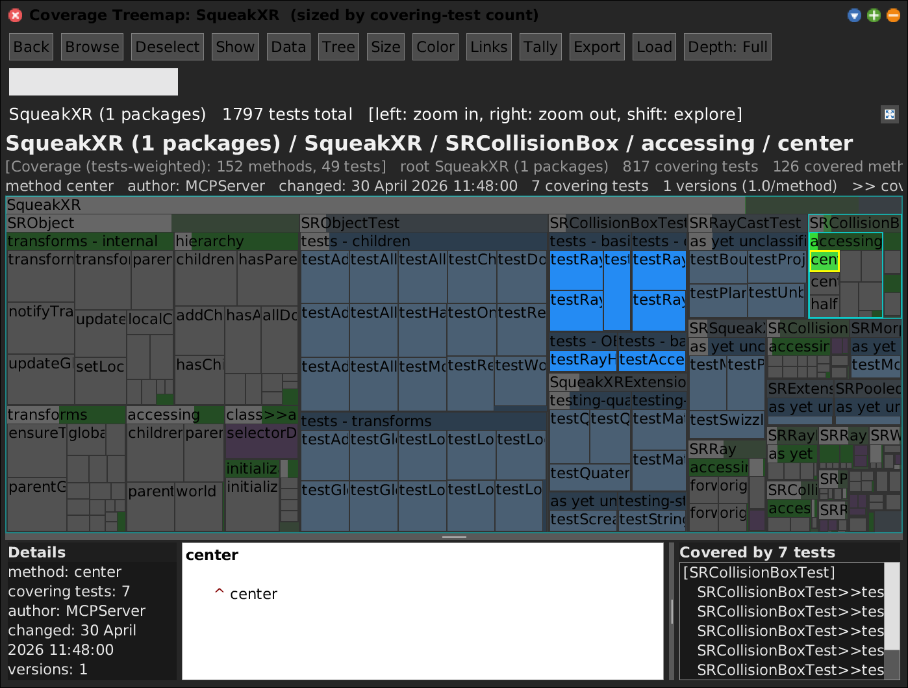
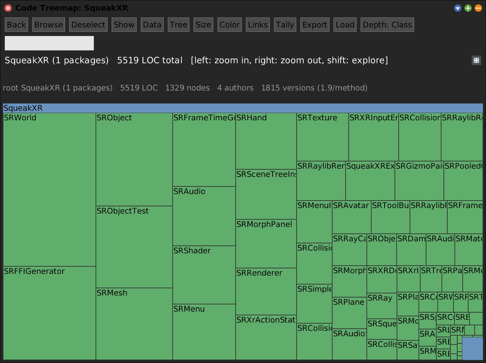
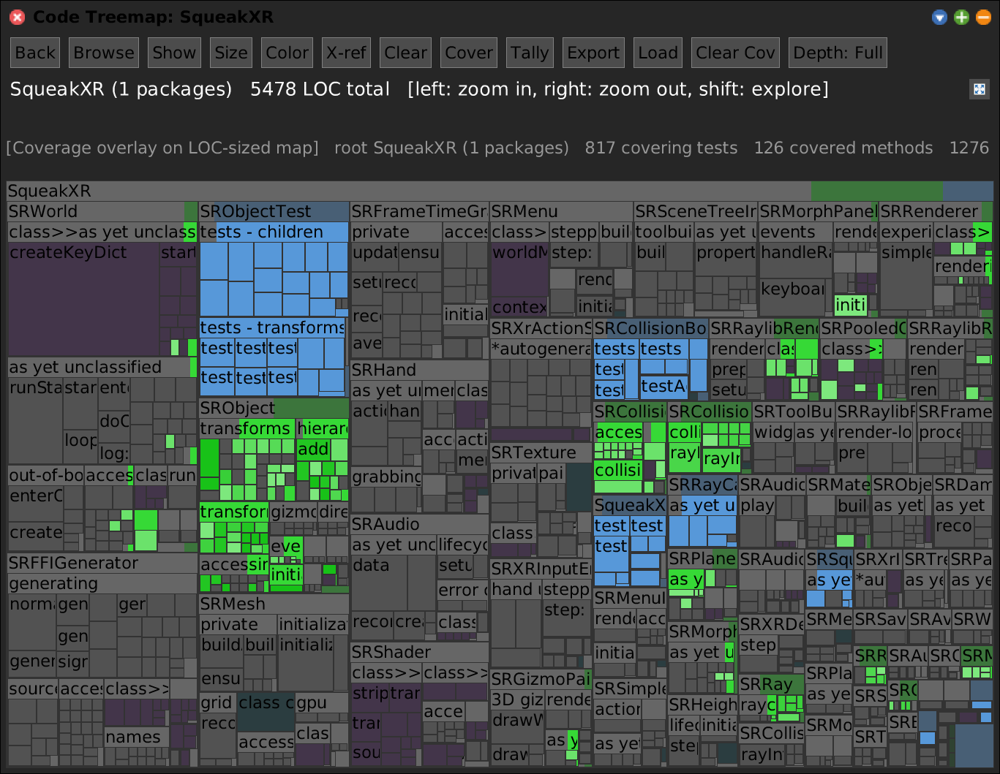
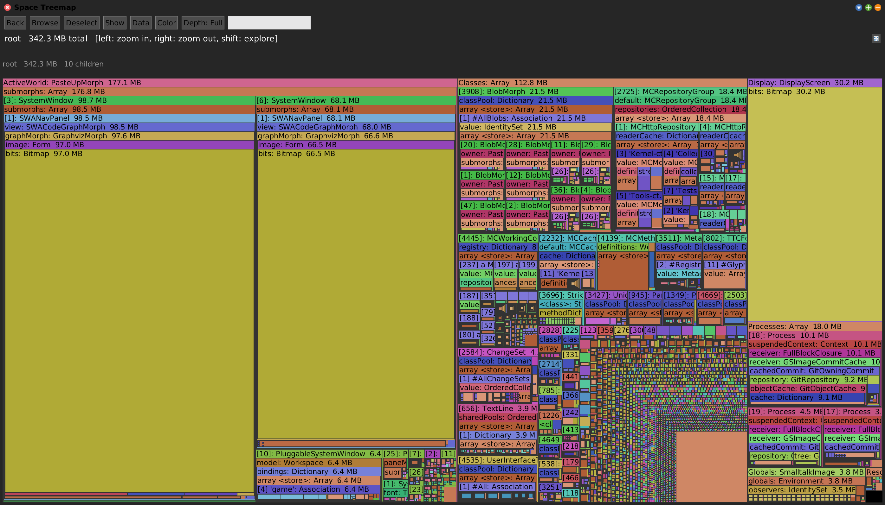
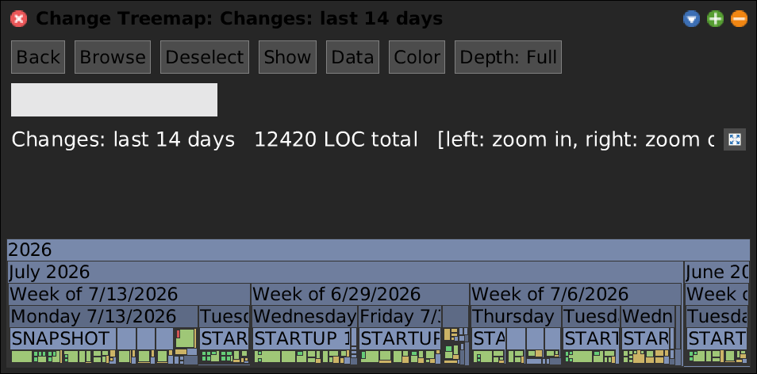
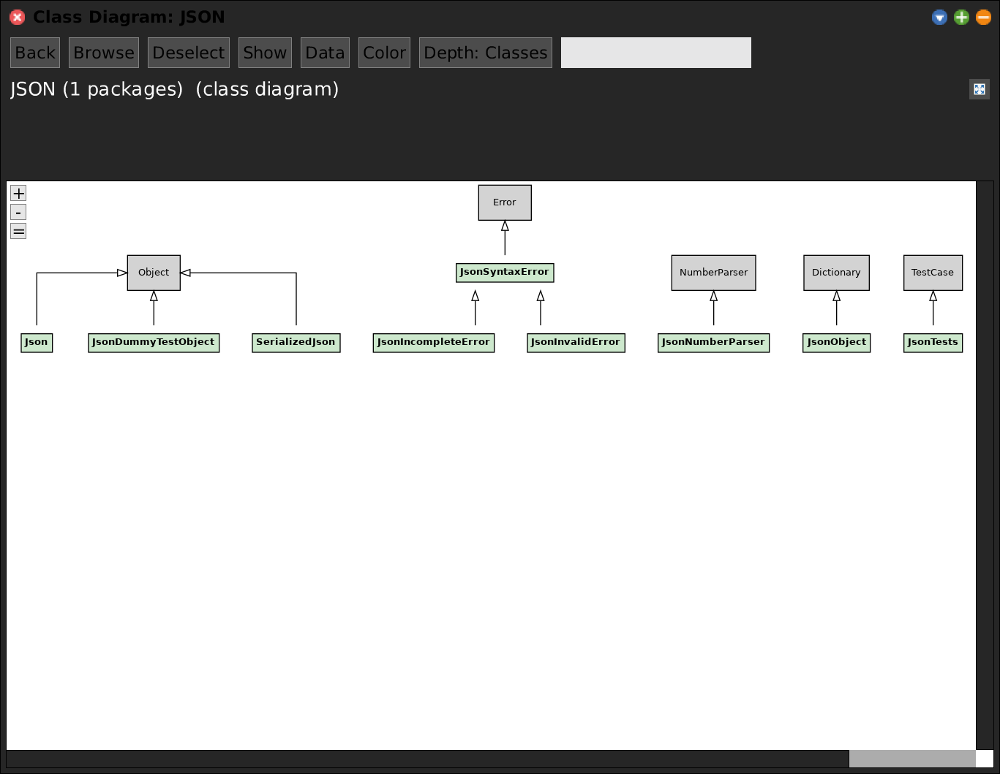

# SWA Tools -- Gallery

A one-look overview of the SWA tool suite. Each tool visualises a tree of
`SWANode`s through the shared view layer (`SWAView` + `SWAPane`) as a
navigable squarified treemap, flamegraph, or diagram, and any tool can colour
itself by another's data because they all speak the same `crossRefKey`
vocabulary. See [index.md](index.md) for the shared-layer and dataset details,
[packages.md](packages.md) for the package/dependency map, and the per-tool docs
linked below.

## The shared view layer

Not a tool of its own -- the substrate every tool is built on. One tree contract
(`SWANode`: `parent`/`children`, `depth`, `pathString`, `crossRefKey`), one morph
(`SWAView`: selection, cached-Form render, the dataset layer), and one chrome
(`SWAPane`: **Back / Browse / Deselect / Show / Data / Tree / Size / Color /
Links** + breadcrumb + two info lines + the toggleable **Show** row with Details /
source / cross-reference panes). The header is rebuilt per view and
capability-gated, so it changes as you morph one tool into another. Below: the
Code Map in **Show** mode -- the full chrome, breadcrumb, selection highlight, and
the details/source/covering-tests panes are all view-layer features.

<!-- SCREENSHOT gallery-viewlayer.png (shared chrome + Show row; needs squeakxr-coverage.json alongside)
| w tm panel data leaf |
data := SWACoverageData fromFile: 'squeak-object-space-tally/doc/squeakxr-coverage.json'.
w := SWAPane openCoverage: 'squeak-object-space-tally/doc/squeakxr-coverage.json' onPackageNamed: 'SqueakXR' leafKind: nil.
tm := w allMorphs detect: [:m | m isKindOf: SWACodeTreemapMorph].
panel := w allMorphs detect: [:m | m isKindOf: SWAPane].
leaf := nil.
tm rootNode withAllChildrenDo: [:n |
	(leaf isNil and: [(n isKindOf: SWACodeMethodNode) and: [(data coveringTestCountFor: n crossRefKey) >= 2]])
		ifTrue: [leaf := n]].
tm selectTileNode: leaf.
panel toggleSource.
World displayWorld. (Delay forMilliseconds: 700) wait. World displayWorld. (Delay forMilliseconds: 300) wait.
PNGReadWriter putForm: w imageForm onFileNamed: 'squeak-object-space-tally/doc/gallery-viewlayer.png'.
w delete.
-->

## Tools

### Code Map -- the generic code-structure treemap

The **Code Map is the generic tool** of the suite: the
`package -> class -> category -> method` tree rendered as a squarified treemap,
where tile **area** is a size metric (LOC / bytes / method count / execution
counts) and tile **colour** is an orthogonal property, both switched live from the
**Size** / **Color** buttons. Full doc: **[SWACodeMap.md](SWACodeMap.md)**.

<!-- SCREENSHOT gallery-codemap.png
| w |
w := SWAPane openOnPackageNamed: 'SqueakXR' leafKind: #class.
World displayWorld. (Delay forMilliseconds: 500) wait. World displayWorld. (Delay forMilliseconds: 200) wait.
PNGReadWriter putForm: w imageForm onFileNamed: 'squeak-object-space-tally/doc/gallery-codemap.png'.
w delete.
-->

**Intrinsic colour modes** (no external data; `Color` menu): `kind`, `author`,
`recency`, `churn` (method-version count), average-LOC, and the
documentation/string/code **byte-composition**.

Beyond the intrinsic modes, the Code Map is coloured/sized by **datasets** --
named data sources loaded from a file or read live from another open panel. Three
dedicated analysis models (each its own `SWA-*` package) plug in this way; the
`open...` methods below are just presets that load the dataset and pick its mode:

- **Coverage** (`SWA-Coverage`, `SWACoverageData`) -- load a coverage JSON to tint
  covered methods green, tests blue, evicted red; optionally *size* by
  covering-test count so untested code collapses. Container tiles roll up their
  covered methods. Presets: `openCoverage:onPackageNamed:` /
  `openInvocations:onPackageNamed:`.

  

- **Duplication** (`SWA-Duplication`, `SWADuplicationData`) -- load a duplication
  JSON to surface copy-paste / similarity clusters, tinting members of the same
  clone group together (`colorByDuplication:`).

- **Topic model** (`SWA-TopicModel`, `SWATopicData` from a Biterm Topic Model) --
  load a topic JSON so each method-leaf is tinted by its **dominant topic's hue
  family** (brightness = confidence), while aggregate tiles get a proportional
  **topic-mixture bar**. Image-independent (`Class>>selector` keyed). Preset:
  `openTopics:onPackageNamed:`; generate the file with
  `(SWABitermTopicModel onPackageNamed: 'Morphic') buildAndRun: 200`.

- **Call Tally** -- colour/size by a live profiler's per-method sample weight,
  picked as a `#peer` dataset from the **Data** menu (container tiles roll up
  their sampled methods).

Because area and colour are independent and datasets stack onto the same
`crossRefKey` vocabulary, one map answers many questions at once -- *which classes
are large, comment-heavy, recently churned, poorly covered, or duplicated?*

### Space Tally -- object-memory treemap

Walks the *live object graph* (BFS from the roots) and tiles it by retained
**bytes**, so you see where the memory goes and who keeps it alive. Full doc:
**[SWASpaceTally.md](SWASpaceTally.md)**.

<!-- SCREENSHOT gallery-spacetally.png (whole-image walk; a few seconds)
| w |
w := SWASpaceTally openTreemap.
World displayWorld. (Delay forMilliseconds: 1500) wait. World displayWorld. (Delay forMilliseconds: 500) wait.
PNGReadWriter putForm: w imageForm onFileNamed: 'squeak-object-space-tally/doc/gallery-spacetally.png'.
w delete.
-->

### Sampling Tally -- statistical profiler flamegraph

The **Sampling Tally** (`SWASamplingTally`) is the *statistical* message tally:
it drives the external **st-spy** sampler over a running image and presents the
wall-clock call tree as a flamegraph (also treemap / explorer). Shows *where time
goes*. (st-spy is the internal sampler binary, not the user-facing name.) Stub doc:
**[SWAMessageTally.md](SWAMessageTally.md)**.

<!-- SCREENSHOT gallery-stspy.png (reuses an existing chrome-trace file rather than live recording)
| spy w |
spy := SWASamplingTally new.
spy pid: 18463.
spy parseTraceFile: '18463-2026-06-19T13:45:32+02:00.json'.
w := spy openFlamegraph.
World displayWorld. (Delay forMilliseconds: 1200) wait. World displayWorld. (Delay forMilliseconds: 400) wait.
PNGReadWriter putForm: w imageForm onFileNamed: 'squeak-object-space-tally/doc/gallery-stspy.png'.
w delete.
-->

`SWASamplingTally open` records THIS image for 10 s and opens the flamegraph. Live
recording needs the `./st-spy` binary in the VM's working directory.

### Change Map -- `.changes`-file time treemap

A time-bucketed treemap over the `.changes` file
(`year -> month -> week -> day -> save -> package -> class -> change`), tile weight
= diff-line count. Selecting a change shows an inline diff. Documented in the
journal: [2026-07-09](../../journal/2026-07-09-swachangeparser-change-treemap-and-recovery.md).

<!-- SCREENSHOT gallery-changemap.png
| w |
w := SWAChangeParser openLastDays: 14.
World displayWorld. (Delay forMilliseconds: 1500) wait. World displayWorld. (Delay forMilliseconds: 500) wait.
PNGReadWriter putForm: w imageForm onFileNamed: 'squeak-object-space-tally/doc/gallery-changemap.png'.
w delete.
-->

### Class Diagram -- inheritance diagram

A UML-style class diagram on the SWA view layer (`SWAClassDiagram`): record
boxes + inheritance edges laid out via Graphviz, external superclasses as
lightgray placeholders, click a class/method to drive nav-panel selection.
Documented in the journal:
[2026-07-13](../../journal/2026-07-13-classdiagram-graphviz-json-and-graph-view.md).

<!-- SCREENSHOT gallery-classdiagram.png (small package: the diagram is only legible on small packages)
| w |
w := SWAClassDiagram openOnPackageNamed: 'JSON'.
World displayWorld. (Delay forMilliseconds: 800) wait. World displayWorld. (Delay forMilliseconds: 300) wait.
PNGReadWriter putForm: w imageForm onFileNamed: 'squeak-object-space-tally/doc/gallery-classdiagram.png'.
w delete.
-->

## Not tools

- **Graphviz viewer** (`SWA-Graphviz`: `GraphvizMorph` / `GraphvizPane` /
  `GraphvizJsonParser` / `GraphvizPlainParser`) -- an implementation detail behind
  the Class Diagram, not a user-facing tool.
- **The Sim harness** (`SWASimSpaceTally` / `SWASimSpaceTallyNode` /
  `SimObjectMirror`, in `SWA-SpaceTally`) -- a simulation/parity harness for the
  Space Tally.
- **Analysis data models** (`SWA-Coverage`, `SWA-Duplication`, `SWA-TopicModel`) --
  produced and consumed as Code Map *datasets* (see below), not tools in their own
  right.

See **[packages.md](packages.md)** for the full package map.

## Housekeeping done while writing this

Naming and scope cleanups applied during the documentation pass:

- Renamed `SWACodeGraphMorph` -> `SWAClassDiagram`.
- Renamed `SWANavPanel` -> `SWAPane`.
- Removed the **containment graph** mode of the class diagram (the old
  `openContainmentOnPackageNamed:` / `#containment` mode) -- it only rendered
  acceptably on tiny packages and is superseded by the treemap Code Map.

Still open: consider whether `SWAView` wants a clearer name alongside `SWAPane`.
