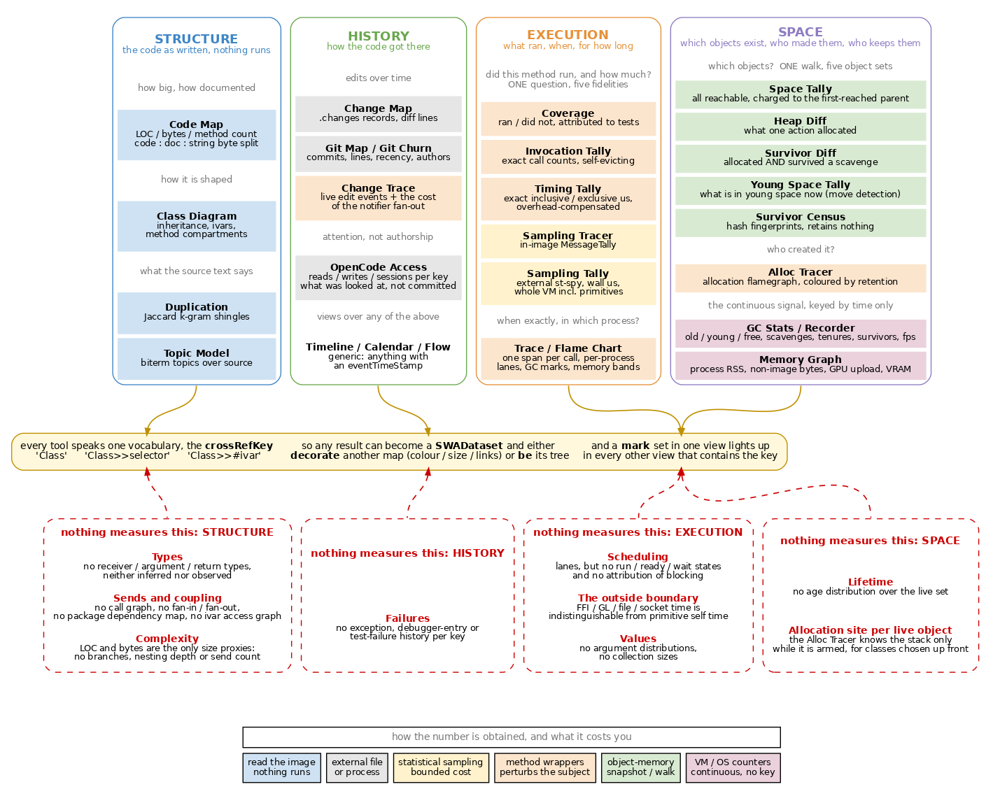

# The SWA Measurement Landscape

Systematic enumeration of what the suite measures, and derivation of what it does
not. The reading of this material, and the coverage argument built on it, is in
[views.md](views.md); resulting work items are in [todo.md](todo.md).
Construction is in [architecture.md](architecture.md), appearance in
[gallery.md](gallery.md), usage in [api.md](api.md).

Also as [SVG](media/swa-landscape.svg).

<!-- FIGURE swa-landscape
Source is media/swa-landscape.dot. Regenerate both renderings from doc/media:
	dot -Tsvg swa-landscape.dot -o swa-landscape.svg
	dot -Tpng -Gdpi=100 swa-landscape.dot -o swa-landscape.png
The PNG is the embedded one. Keep dpi at 100; above that the figure exceeds a
normal page width.

The figure groups tools by the four-way subject partition of section 2, which
section 5 then criticises. It is retained because it matches the package layout
and the menu structure, not because the partition is correct.
-->

## 1. Inventory

Fifteen tools. `Key` is the identity a result is attached to.

| Tool | Subject | Referent | Extent | Acquisition | Key |
|---|---|---|---|---|---|
| Code Map | structure | code | timeless | image read | `crossRefKey` |
| Class Diagram | structure | code | timeless | image read | `crossRefKey` |
| Duplication | structure | code | timeless | source text | `crossRefKey` |
| Topic Model | structure | code | timeless | source text | `crossRefKey` |
| Change Map | history | code | series | `.changes` file | `crossRefKey` + t |
| Git Map / Churn | history | code | series | git repository | `crossRefKey` + t |
| Change Trace | history | event | interval | instrumentation | `crossRefKey` + t |
| OpenCode Access | history | code | series | `opencode.db` | `crossRefKey` + t |
| Timeline / Calendar / Flow | history | any | series | (view over the above) | inherited |
| Coverage | execution | event | interval | wrapper | `crossRefKey` |
| Invocation Tally | execution | event | interval | wrapper | `crossRefKey` |
| Timing Tally | execution | event | interval | wrapper | `crossRefKey` |
| Sampling Tracer | execution | event | interval | in-image sampler | `crossRefKey` |
| Sampling Tally | execution | event | interval | external sampler | `crossRefKey` |
| Trace / Flame Chart | execution | event | interval | wrapper | `crossRefKey` + t |
| Space Tally | space | object | instant | graph walk | class |
| Heap Diff | space | object | instant | heap sweep x2 | class, home method |
| Survivor Diff | space | object | instant | heap sweep x2 + GC | class, home method |
| Young Space Tally | space | object | instant | move detection | class, home method |
| Survivor Census | space | object | instant | hash fingerprints | class |
| Alloc Tracer | space | event | interval | wrapper | `crossRefKey` |
| GC Stats / Recorder | space | VM | series | VM counters | t only |
| Memory Graph | space | OS process | series | `/proc`, NVML | t only |

## 2. The four-way subject partition

The partition currently in use, and the form of its claim:

| Subject | Claim form |
|---|---|
| Structure | code element X has property P |
| History | code element X changed at time t by agent A |
| Execution | code element X ran, n times, for d microseconds |
| Space | object of class C exists, size s, retained by R |

Consequences of the partition, each observable in the tools:

- Structure answers without running the program; it is the only subject whose
  claims cover code that has never executed.
- History is the only subject whose claims are durable. All others are claims
  about one moment or one run.
- Execution claims are existential, not universal. Absence of a datum is
  ambiguous between not run, not instrumented, and evicted.
- Space measurement perturbs its own subject. `SWA-HeapDiff` and `SWA-GCStats`
  are largely constructed around avoiding this.

## 3. Overlap

Tools sharing a cell of the partition answer one question at different cost and
fidelity.

### 3.1 Execution: five instruments for one question

| Tool | Cost | Resolution | Unique capability |
|---|---|---|---|
| Coverage | one wrapper, one-shot | boolean | attribution to the covering test |
| Invocation Tally | wrapper per call | exact count | counts for cold methods |
| Timing Tally | wrapper + 2 clock reads | exact us, incl./excl. | exclusive time, overhead-compensated |
| Sampling Tracer | in-image MessageTally | statistical us | no wrappers, hence no eviction or stranding |
| Sampling Tally | external process | statistical us | primitives, VM frames, a wedged image |

Wrappers are exact and perturbing; samplers are approximate and cheap. The two
diverge on short methods, where wrapper overhead dominates the measurement, and
on cold methods, which samplers miss entirely. Both project onto the same key,
so divergence between them is itself observable.

The Trace differs in axis rather than fidelity: it retains each call as an
individual span with start and duration. Repeated calls, gaps and inter-process
interleaving are representable only there; totals are not representable there at
all.

### 3.2 Space: one walk, five object sets

| Tool | Object set | Perturbation |
|---|---|---|
| Space Tally | all reachable, charged to first-reached parent | GC, then closed-universe BFS |
| Heap Diff | allocated between two sweeps | none between sweeps, by construction |
| Survivor Diff | as above, minus one scavenge | one `garbageCollectMost` |
| Young Space Tally | current young space | none (move detection) |
| Survivor Census | survivors as hash fingerprints | none; retains nothing |

The last two exist because the direct approaches are self-defeating: a snapshot
array retains every object it names, and a collection removes the transient
objects under study.

The Alloc Tracer is the complement of all five: they attribute retention, it
attributes creation.

### 3.3 The unjoined family

GC Stats, GC Recorder and Memory Graph produce continuous signals with a time
axis and no `crossRefKey`. They are the only tools not on the join. They are
read against the others by shared clock, not by shared key; the Trace draws the
same counters as bands over its lanes.

## 4. The join

Two mechanisms make the inventory a suite.

**`crossRefKey`.** A single identity vocabulary (`'Class'`,
`'Class>>selector'`, `'Class>>#ivar'`), emitted by every tool and indexed by
every view. Image-independent, therefore serialisable.

**`SWADataset`.** A keyed result can either decorate another view, by binding a
metric to colour, size or links, or supply that view's tree, via `SWAStructure`.
A live peer view is a dataset (`SWAPeerViewSource`); set arithmetic over two
datasets is a dataset (`SWAMaskSource`). The operation closes over its operands.

Consequence: the redundancy of section 3.1 is not waste. Five answers to one
question are five metrics on one tile.

## 5. Are these good dimensions?

No. Structure / history / execution / space is one axis with four values, not
four dimensions, and the values are impure.

The framing adopted instead is **perspective**, developed in
[views.md](views.md): a view has a footprint, a resolution, a cost and a blind
spot, which makes redundancy and removability askable. The grid below remains the
means of deriving coverage systematically; it is the instrument, not the reading.

**Objection 1: time is folded into a value.** History is structure over time;
GC Stats is space over time; the Trace is execution located in time. Time is
being used both as a category and as a property of the other categories.

**Objection 2: structure and space are the same kind of claim.** Both describe a
graph of entities and their relations. They differ in what the nodes are: code
elements versus objects. That is a referent distinction, not a subject
distinction.

**Objection 3: execution is of a different ontological kind.** Code elements and
objects are entities; a call is an event. Three kinds, not four.

### 5.1 Corrected decomposition

Two axes account for the partition:

- **Referent** — what the claim is about: `code`, `object`, `event`, `external`
  (OS process, GPU, device).
- **Extent** — its temporal form: `timeless` (a property, no clock), `instant`
  (state at t), `interval` (start plus duration), `series` (repeated samples).

Present coverage, from the inventory in section 1:

| | timeless | instant | interval | series |
|---|---|---|---|---|
| **code** | Code Map, Class Diagram, Duplication, Topic Model | — | — | Change Map, Git Map, OpenCode Access |
| **object** | (weak: class summary) | Space Tally, Heap Diff, Survivor Diff, Young Space Tally, Survivor Census | — | — |
| **event** | — | Change Trace, GC markers | Coverage, the three tallies, both samplers, Trace, Alloc Tracer | (weak: scavenge rate) |
| **external** | — | Memory Probe | — | Memory Graph, GC Stats |

The four subjects are four cells of this grid (code/timeless, code/series,
event/interval, object/instant) plus the external row. The grid is worth
adopting because the empty cells reproduce every gap previously found by
inspection, and add several that inspection missed:

| Empty cell | Missing measurement |
|---|---|
| code / instant | a code state snapshot; hence no comparison of two versions or two images |
| code / interval | the lifetime of a code element: introduced at, removed at |
| object / interval | object lifetimes and age distribution |
| object / series | population per class over time (GC Stats gives aggregate bytes only) |
| event / timeless | the set of possible events, i.e. the static call graph |
| event / series | event rate per key: calls/s, exceptions/s |
| external / interval | duration of an FFI, GL, file or socket call |

Two further axes are already implicit in the figure and should be named
separately, since they are currently conflated:

- **Acquisition** — image read, source parse, instrumentation, sampling, heap
  sweep, counter read, external import.
- **Perturbation** — none, bounded, proportional to the phenomenon, destructive.
  Not a function of acquisition: the Survivor Census is a heap sweep with zero
  perturbation, whereas the Space Tally forces a collection and retains its
  results.

A fifth axis, **scope**, distinguishes method, package, image, OS process and
device. The suite has no value above `device`: nothing compares the desktop and
Quest images.

## 6. Omitted dimensions

Beyond empty cells of the grid, the following axes are absent entirely.

**Modality: actual versus intended.** Every tool measures what is. Nothing
records what ought to be: no specifications, contracts, invariants or asserted
properties. Tests appear only as coverage attribution, never as claims about
behaviour.

**Correctness.** The suite measures quantity throughout and quality nowhere. No
failure rates, exception frequencies, test outcomes or assertion violations are
attached to any key.

**Comparison.** Every result describes one image at one time. Differencing
exists in three ad-hoc forms (Heap Diff, Survivor Diff, the `B \ A` mask) but is
not a general operation over datasets. Regression between two runs or two
versions is therefore unobservable.

**Uncertainty.** No result carries an error estimate. Sampled and exact values
are rendered identically, although section 3.1 rests on the two differing.

**Agency.** Causal attribution exists for edits (git author, opencode session)
and for no runtime fact. Nothing attributes an allocation, a collection or a
dropped frame to an actor.

**Non-temporal cost.** Time and bytes are the only currencies. Energy, network
volume and monetary cost are absent. Note that `SWAOpenCodeSession` already
holds `cost` and five token counts; these describe agent sessions and are never
projected onto code.

**Human attention.** OpenCode Access records what the agent read. Nothing
records what the developer read, although the browser and the panes are in the
same image.

## 7. Summary of gaps, by owner

| Missing | Grid cell | Owner |
|---|---|---|
| Receiver / argument / return types | event/timeless, and dynamic via wrappers | Code Map |
| Call graph, coupling, fan-in/out, package dependencies | event/timeless | Code Map, into Class Diagram |
| Complexity beyond LOC: branches, nesting, send count | code/timeless | Code Map |
| Failure and exception history | — (omitted dimension: correctness) | new dataset |
| Process states, blocking attribution | event/interval | Trace |
| FFI / GL / file / socket duration | external/interval | Trace, tally family |
| Argument and collection-size distributions | event/timeless | tally family |
| Object age distribution | object/interval | Space Tally |
| Allocation site for an arbitrary live object | object/interval | Alloc Tracer |

Types are the load-bearing gap. In Smalltalk a send cannot be resolved without
the receiver's class, so the absent call graph follows from the absent types,
and coupling, dependency and complexity analyses follow from the call graph.

Two routes exist. Static: a parse-tree walk with inference over literals,
`self`, `super`, instance-variable assignment and unique implementors; cheap,
always available, unsound in the interesting cases. Dynamic: record receiver and
argument classes at each wrapped call. `SWAMethodWrapper>>run:with:in:` already
holds both and discards them, so the second route is a wrapper subclass plus a
dataset kind.

## 8. Conclusion

Coverage is asymmetric. The event and object referents are covered redundantly
(five instruments for one execution question, five object sets over one heap
walk). The code referent is covered only in its extensional properties: length
of the source text, time of change, vocabulary of its words.

No tool in the suite represents what a method does — what it sends, what it
touches, what types pass through it. Every structural claim currently made could
be produced without parsing Smalltalk.
