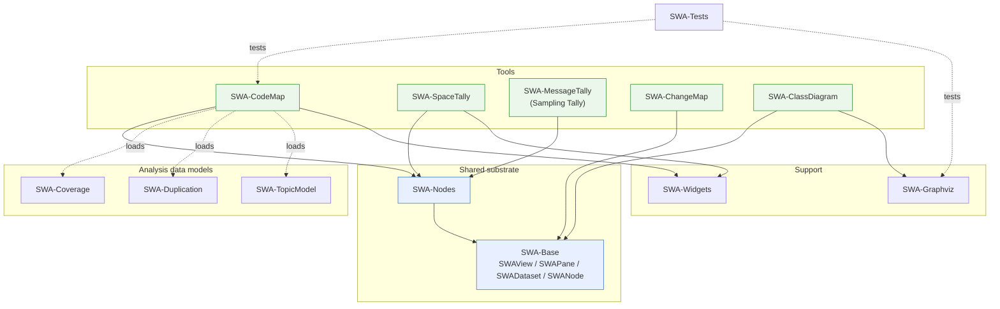
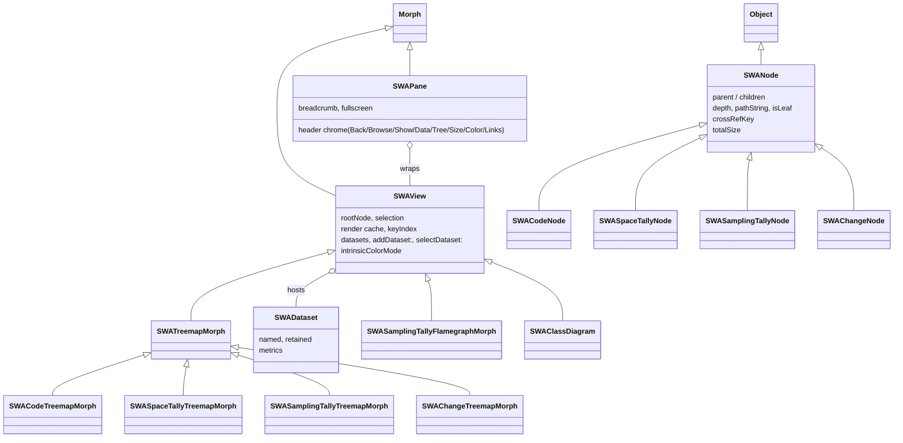

# SWA Code Maps -- Package Overview

> For the engineering-level layering (view/data/dataset spines, instrumentation
> substrate, extension points) see **[architecture.md](architecture.md)**; for the
> protocols **[api.md](api.md)**; for debt/open-ends **[smells.md](smells.md)**.
> Note: the class-hierarchy diagram below omits several later additions --
> `SWACodeInstVarNode`, `SWACodeMarkSetRootNode`, `SWAMaskSource`, `SWAStructure`, and
> the marks/instrumentation family (`SWAMarkSet`, `SWAMethodWrapper`,
> `SWACapturingLayer`, the wrappers). architecture.md covers these.

The suite ships as 14 `SWA-*` packages (13 code + 1 test). They layer cleanly:
a shared **Base** view/tree/dataset substrate, a shared **Nodes** tree-model
layer, and then one package per user-facing **tool**, plus a few supporting
packages (Graphviz backend, small widgets, analysis data models).

> Source of truth is the live image. The counts below are read from the image's
> `SWA-*` system categories; if they drift, re-run the snippet at the bottom.

## Packages at a glance

| Package | Classes | Methods | Role |
|---|---:|---:|---|
| **SWA-Base** | 9 | 342 | Shared substrate: view (`SWAView`), chrome (`SWAPane`), base treemap, tree contract (`SWANode`), dataset layer (`SWADataset`/`SWADatasetMetric`), peer data source, method wrapper |
| **SWA-Nodes** | 9 | 266 | Concrete tree-node models for each tool (`SWACode*Node`, `SWASpaceTallyNode`, `SWASamplingTallyNode`) |
| **SWA-CodeMap** | 2 | 111 | The static Code Map treemap + overlay |
| **SWA-SpaceTally** | 13 | 265 | Object-memory treemap, explorer, JSON reader/writer, and the Sim parity harness |
| **SWA-MessageTally** | 5 | 84 | Sampling (statistical) message tally: flamegraph + treemap views, driven by the external st-spy sampler |
| **SWA-ChangeMap** | 4 | 105 | `.changes`-file time treemap + parser |
| **SWA-ClassDiagram** | 1 | 31 | UML-style inheritance diagram view |
| **SWA-Graphviz** | 4 | 86 | Graphviz render/parse backend (used by Class Diagram) |
| **SWA-Coverage** | 5 | 137 | Coverage data model, run panel, log tailer, method wrapper |
| **SWA-Duplication** | 3 | 42 | Copy-paste / similarity data model |
| **SWA-TopicModel** | 2 | 54 | Biterm topic model over method source (for labelling) |
| **SWA-Widgets** | 4 | 30 | Reusable morphs: splitters, search field, selection painter |
| **SWA-Tests** | 3 | 38 | SUnit tests + fixtures |

Totals as read from the image: **64 classes**, **1591 methods** across all 14
`SWA-*` packages (13 code + `SWA-Tests`).

## Layered dependency view



Solid arrows are structural (subclassing / direct use); dotted arrows are
runtime data flow -- e.g. the Code Map does not statically depend on
`SWA-Coverage`; it *loads* a `SWACoverageData` as a dataset at runtime.

## The shared substrate (`SWA-Base` + `SWA-Nodes`)

Everything else is built on three abstractions in `SWA-Base`, with the concrete
per-tool node models split out into `SWA-Nodes`.



- **`SWANode`** (`SWA-Base`) is the tree contract: `parent`/`children`, `depth`,
  `pathString`, `isLeaf`, `withAllChildrenDo:`, and the `crossRefKey` that lets
  any tool colour itself by any other's data (class names are unique; methods
  are `'Class>>selector'`). Concrete node classes live in **`SWA-Nodes`**.
- **`SWAView`** (`SWA-Base`) is the shared `Morph`: `rootNode`, selection, the
  cached-Form render, the `keyIndex`, and the **dataset layer** (`datasets`,
  `addDataset:`, `selectDataset:`, `setDataMode:`, `metricForMode:`). Every
  treemap/flamegraph/diagram subclasses it.
- **`SWAPane`** (`SWA-Base`) is the chrome that wraps any `SWAView`: the
  capability-gated header, breadcrumb, and fullscreen toggle. Rebuilt per view,
  so the buttons change as you morph one tool into another.

Datasets are the unifying data path: a `SWADataset` is a named, retained source
(loaded from a file, or read live from another open panel via `SWAPeerViewSource`)
carrying one or more `SWADatasetMetric`s bindable to the colour/size/links axes.
See [index.md](index.md#datasets-the-unified-data-path) for the full story.

## Tool packages

Each tool package adds a node model (in `SWA-Nodes`) and one or more `SWAView`
subclasses (the treemap/flamegraph/diagram) plus its overlay.

- **SWA-CodeMap** -- `SWACodeTreemapMorph` + overlay. The `package -> class ->
  category -> method` treemap; tile area = a size metric, colour = an orthogonal
  property. Loads `SWA-Coverage` / `SWA-Duplication` / `SWA-TopicModel` data as
  datasets. Full doc: **[SWACodeMap.md](SWACodeMap.md)**.
- **SWA-SpaceTally** -- `SWASpaceTally` walks the live object graph (BFS) and
  tiles by retained bytes; ships explorer, JSON reader/writer, treemap, and the
  `SWASim*` parity harness. Full doc: **[SWASpaceTally.md](SWASpaceTally.md)**.
- **SWA-MessageTally** -- the **Sampling Tally**: `SWASamplingTally` drives the
  external st-spy sampler (a statistical/sampling profiler; st-spy is an internal
  implementation detail) and presents the call tree as a flamegraph or treemap.
  Stub doc: **[SWAMessageTally.md](SWAMessageTally.md)**.
- **SWA-ChangeMap** -- `SWAChangeParser` + `SWAChangeTreemapMorph`: a
  time-bucketed treemap over the `.changes` file. Journal:
  [2026-07-09](../../journal/2026-07-09-swachangeparser-change-treemap-and-recovery.md).
- **SWA-ClassDiagram** -- `SWAClassDiagram`: a UML-style inheritance diagram laid
  out via the **SWA-Graphviz** backend. Journal:
  [2026-07-13](../../journal/2026-07-13-classdiagram-graphviz-json-and-graph-view.md).

## Supporting packages

- **SWA-Graphviz** -- `GraphvizMorph` / `GraphvizPane` / `GraphvizJsonParser` /
  `GraphvizPlainParser`: the render/parse backend behind the Class Diagram, not a
  user-facing tool.
- **SWA-Coverage** / **SWA-Duplication** / **SWA-TopicModel** -- analysis data
  models (and, for coverage, a run panel + log tailer). Produced/consumed as
  Code Map datasets rather than being tools in their own right.
- **SWA-Widgets** -- reusable morphs (`SWAListSplitter`, `SWASourceSplitter`,
  `SWASearchFieldMorph`, `SWASelectionPainter`) shared by the panes.
- **SWA-Tests** -- SUnit coverage for the parsers and datasets.

## Regenerating the inventory

The tables above are read from the image. To refresh them:

```smalltalk
(SystemOrganization categories asSortedCollection asArray
    select: [:c | c beginsWith: 'SWA-'])
  collect: [:c |
    | names methods |
    names := SystemOrganization listAtCategoryNamed: c.
    methods := names inject: 0 into: [:sum :nm |
      | cl | cl := Smalltalk at: nm ifAbsent: [nil].
      cl isNil ifTrue: [sum] ifFalse: [sum + cl selectors size + cl class selectors size]].
    { c. names size. methods }]
```
